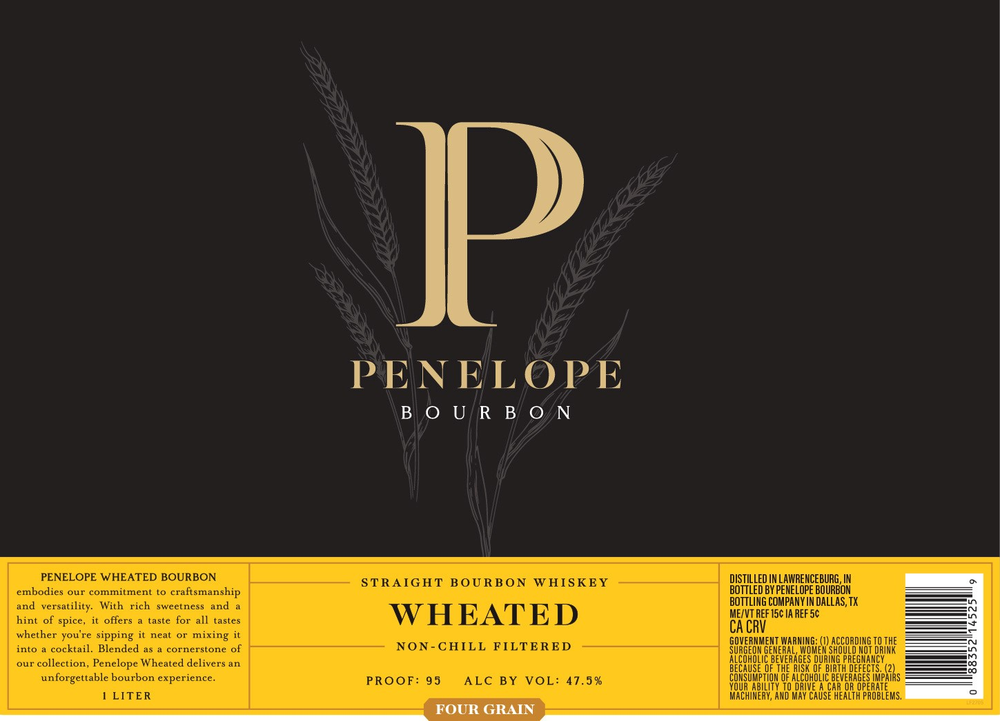
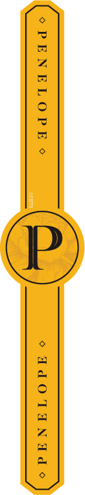

# TTB COLA Label Images - TTBID 26103001000465

**Brand Name:** PENELOPE

**Fanciful Name:** WHEATED

**Issue Date:** 04/14/2026

**Origin Code:** 44

**Product Class/Type:** 101

**Source:** [TTB Public COLA Registry](https://ttbonline.gov/colasonline/viewColaDetails.do?action=publicFormDisplay&ttbid=26103001000465)

## Label Images

### Label 1

### Label 2

## Extracted Label Text

*Text extracted via OCR - may contain errors*

*1 image(s) excluded: text did not meet readability threshold*

**Detected Proof:** 95

### Label 1

PENELOPE WHEATED BOURBON
embodies our commitment to craftsmanship
and versatility. With rich sweetness and a
hint of spice, it offers a taste for all tastes
whether you're sipping it neat or mixing it
into a cocktail, Blended as a cornerstone o
our collection, Penelope Wh

unforgettable bourbon expe

1 LITER

PENELOPE

BOURBON

STRAIGHT BOURBON WHISKEY

HEATED

-CHILL FILTERED

PROOF: 95 ALC BY VOL: 47.5%

Day ere IN LAWRENCEBURG, IN

D BY PENELOPE BOURBON
BOTTLING COMPANY IN DALLAS, TX
ME/VT REF 15¢ IA REF 5¢
CACRV

GOVERNMENT WARMING: () ACCORDING 10 THE
SURGEON GENERAL, WOMEN SHOULD NOT DRINK
ALCOHOLIC ey TAGES DURING PREGNANCY

BECAUSE OF THE RISK OF BIRTH DEFECTS. (2)
CONSUMPTION OF ALCOHOL BEVERAGES PATHS
YOUR ABI IVE ALCAR OR OPERATE

IRCHERY AND MAY CAUSEHEALTA PROBLEMS
