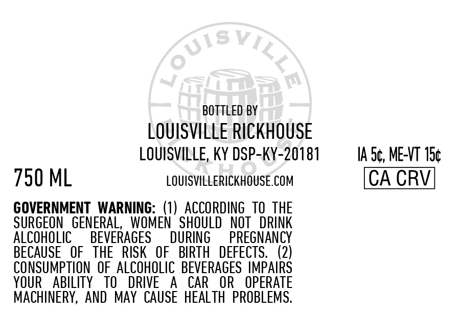
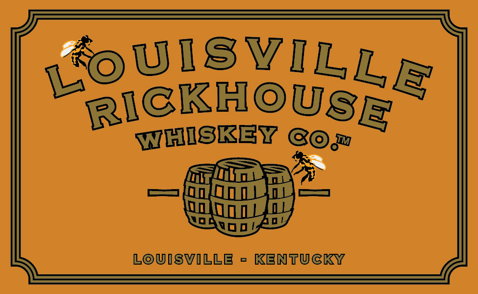
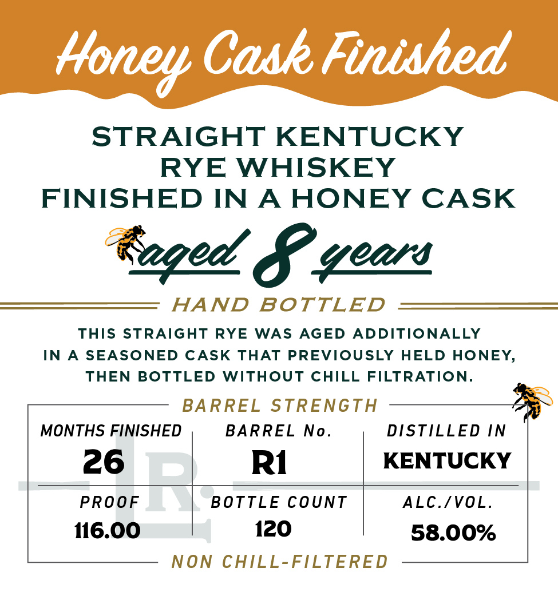

# TTB COLA Label Images - TTBID 26103001000475

**Brand Name:** LOUISVILLE RICKHOUSE WHISKEY CO

**Issue Date:** 04/15/2026

**Origin Code:** 22

**Product Class/Type:** 142

**Source:** [TTB Public COLA Registry](https://ttbonline.gov/colasonline/viewColaDetails.do?action=publicFormDisplay&ttbid=26103001000475)

## Label Images

### Back Label

### Label 1

### Label 2

## Extracted Label Text

*Text extracted via OCR - may contain errors*

**Detected Proof:** 116

### Back Label

BOTTLED BY
LOUISVILLE RICKHOUSE
LOUISVILLE, KY DSP-KY-20181 1Ae, MEAT the
750 ML LOUISVILLERICKHOUSE.COM CA CRV
GOVERNMENT WARNING: (1) ACCORDING TO THE
SURGEON GENERAL, WOMEN SHOULD NOT DRINK
ALCOHOLIC BEVERAGES DURING PREGNANCY
BECAUSE OF THE RISK OF BIRTH DEFECTS. (2)
CONSUMPTION OF ALCOHOLIC BEVERAGES IMPAIRS
YOUR ABILITY TO DRIVE A CAR OR OPERATE
MACHINERY, AND MAY CAUSE HEALTH PROBLEMS.

### Label 1

LoUISvILLE
RIGKHOUSE
WHISKEY
LOUIsVILLE
KENTUCKY
koM

### Label 2

Cask Finished
STRAIGHT
KENTUCKY
RYE WHISKEY
FINISHED IN
A
HONEY CASK
tzged 8 geor
HAND
BOTTLED
ThIS STRAIGHT
RYE
WAS
AGED ADDITIONALLY
IN
A
SEASONED
CASK
THAT PREVIOUSLY
HELD HONEY,
THEN BOTTLED WITHOUT CHILL FILTRATION_
BARREL
STRENGTH
MONTHS FINISHED
BARREL No_
DISTILLED IN
26
R1
KENTUCKY
PROoF
BOTTLE CounT
ALC.IVOL_
116.00
120
58.00%
NON CHILL-FILTERED
Honey
