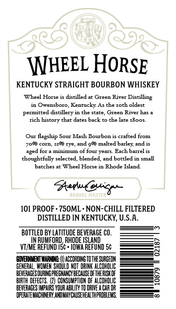
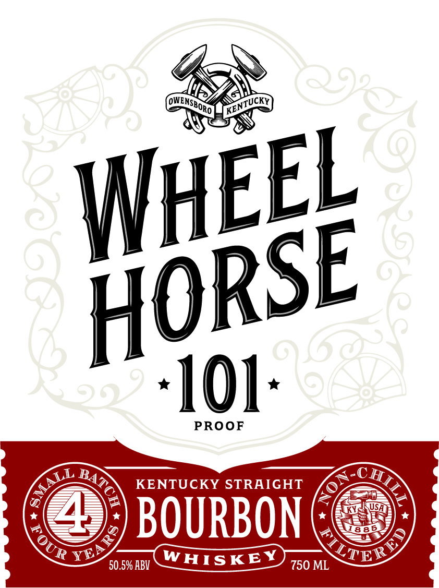

# TTB COLA Label Images - TTBID 26103001000626

**Brand Name:** WHEEL HORSE

**Issue Date:** 04/14/2026

**Origin Code:** 40

**Product Class/Type:** 101

**Source:** [TTB Public COLA Registry](https://ttbonline.gov/colasonline/viewColaDetails.do?action=publicFormDisplay&ttbid=26103001000626)

## Label Images

### Back Label

### Label 1

## Extracted Label Text

*Text extracted via OCR - may contain errors*

**Detected Proof:** 101

### Back Label

\NHEEL HORSE

KENTUCKY STRAIGHT BOURBON WHISKEY

‘Wheel Horse ic distilled at Green River Distilling
in Owensboro, Kentucky. As the roth oldest
permitted distillery in the state, Green River has a
rich history that dates back to the late x800s.

(Our flagship Sour Mash Bourbon is crafted from
70% corn, 210 rye, and 9% malted barley, and is
aged for a minimum of four years. Each barre is

thoughtfully selected, blended, and bottled in small

‘batches at Wheel Horse in Rhode Island,

cst Ca gee

101 PROOF - 750ML- NON-CHILL FILTERED
DISTILLED IN KENTUCKY, U.S.A.

BOTTLED BY LATITUDE BEVERAGE CO.
IN RUMFORD, RHODE ISLAND
VI/ME REFUND I5¢ + IOWA REFUND 5¢

‘GOVERNMENT WARNINE:) ACCORDING TO THE SURGEON
SSENERAL, WOMEN SHOULD NOT DRINK coma
ee
ECTS. (2) CONSUMPTION OF ipa
BGS IMPAIRS YOUR ABILITY TO DRIVE ACAR OR ——
SERITGOER AON OISHAHS

8

### Label 1

101
PROOF
KENTUCKY STRAIGHT
BOURBON
8 86
R
X
50.5% HBV
WHISKEY
750 ML
OWENSBORO
KENTUCKY
WhEEL
HORSE
MMALL _
Kou
BATCH
FOUR
ILTEY
YE
