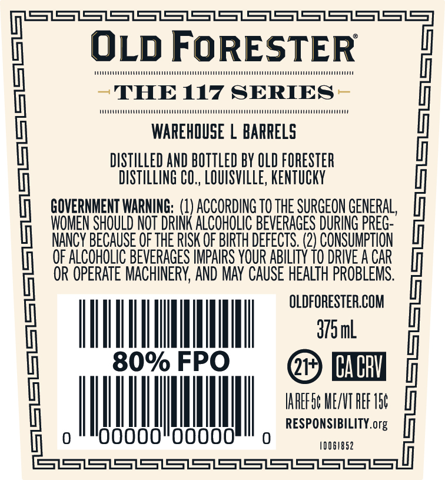
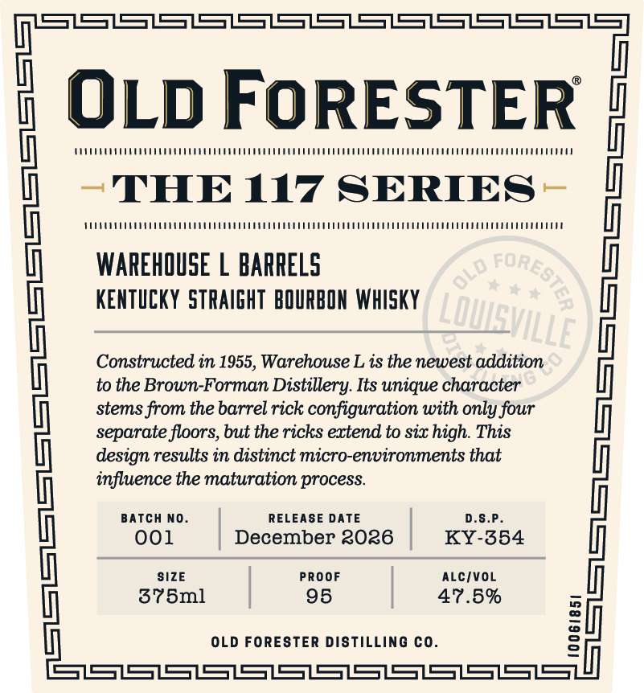
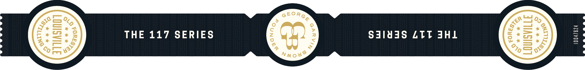

# TTB COLA Label Images - TTBID 26103001000634

**Brand Name:** OLD FORESTER

**Fanciful Name:** WAREHOUSE L BARRELS

**Issue Date:** 04/14/2026

**Origin Code:** 22

**Product Class/Type:** 101

**Source:** [TTB Public COLA Registry](https://ttbonline.gov/colasonline/viewColaDetails.do?action=publicFormDisplay&ttbid=26103001000634)

## Label Images

### Back Label

### Front Label

### Label 2

## Extracted Label Text

*Text extracted via OCR - may contain errors*

*1 image(s) excluded: text did not meet readability threshold*

### Back Label

SSSSSSSSSSSS
OLD FoRESTER
1
A
THE 117 SERIES
WA
WAREHQUSE
BARRELS
DISTILLED AND BOTTLED BY OLD FORESTER
DISTILLING CO,, LOUISVILLE, KENTuCKY
GOVERNMENT WARNING;  (1) ACCORDING TO ThE SURGEON GENERAL,
WOMEN SHOULD NOT DRINK ALcoHoLIc BEVERAGES DURING PREG-
NANCY BECAUSE OF THE RISK OF BIRTH DEFECTS. (2) CONSUMPTION
OF ALcoholIc BeveRAGeS IMPAIRS YOUR ABILITY TO DRIVE A CAR
OR OPERATe MACHINERY, AND MAY  CAUSe HEalth PROBLEMS:
QFHgml eu
|
80% FPO
CacbV
IAFEFSc MEXNT HEF V5c
RESPONSIBILITY.org
0oo
Oooo
1006/852
SSSSSSSSSSS3S3S

### Front Label

SSSS
OLD FoRESTER
THE 117 SERIES
ML
WAREHOUSE
BARRELS
KENTICKY  STRAIGHT  BOURBON WhIsky
{otne Bded-Fasam Dighdese Itss thique caraddetion
|
stems from the barrel rick configuration with only four
separate floors; but the ricks extend to six high. This
design results in distinct micro-environments that
influence the maturation process
BATcH NO
RELEASE DATE
D.S.P
001
December 3036
KY-354
|
378ml
295F
470.,5%
OLD FORESTER DisTiLLING co_
1
H
SSSSSSSSSSSSSS
CORESTe?
OLD
LOMEVILLE
