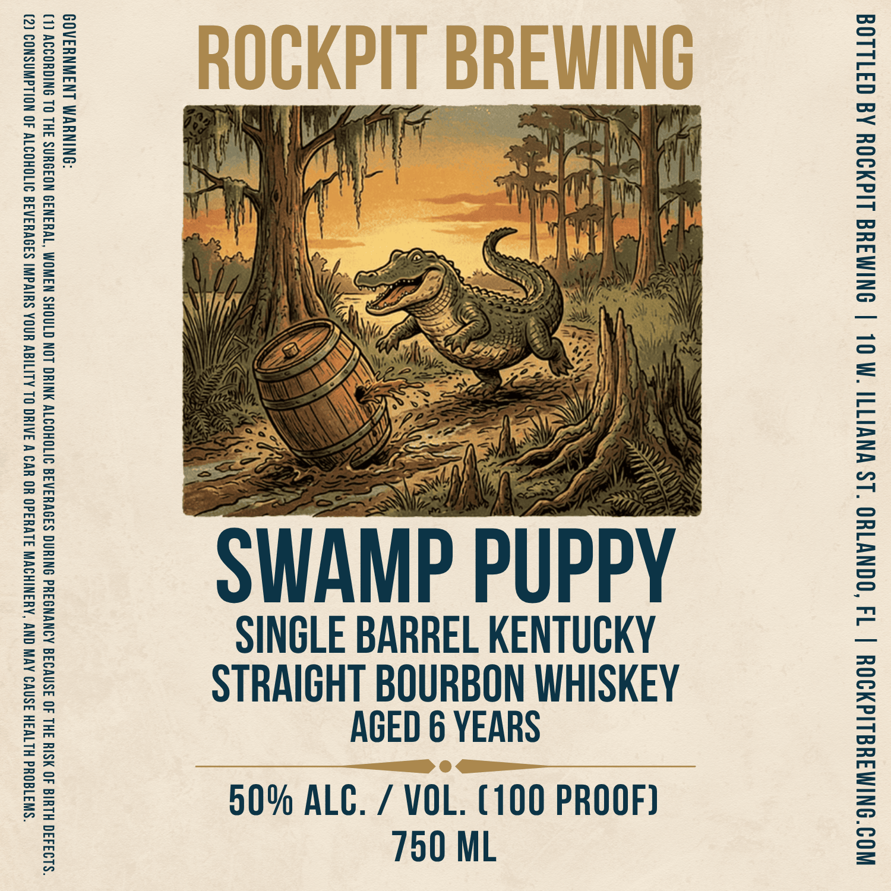

# TTB COLA Label Images - TTBID 26103001000757

**Brand Name:** ROCKPIT BREWING

**Issue Date:** 04/15/2026

**Origin Code:** 16

**Product Class/Type:** 101

**Source:** [TTB Public COLA Registry](https://ttbonline.gov/colasonline/viewColaDetails.do?action=publicFormDisplay&ttbid=26103001000757)

## Label Images

### Label 1

## Extracted Label Text

*Text extracted via OCR - may contain errors*

**Detected Proof:** 90
**Detected Age:** 6 Years

### Label 1

“SIWI180Hd HLIW3H JSNV9 AVN ONY ‘AWANIHOWW J1VHAd0 HO HVS W AAIHO OL ALITIOV HNOA SHIVdWI SI9VHINIG IITOHOITV 40 NOILAWNSNOO (2)

“SITSABIO E AMNGL = 0 SHE 2A. 20 SSMWOSE ASW Gell ONE MO STOWE SIL OAICHCS THD WUC LOW CUMCHS WSL NOM WHE WSO WOSMS SLL Ck SUMO ODEW (1

“ONINUVM LNIWNYIN0S

"SWAMP PUPPY

SINGLE BARREL KENTUCKY

STRAIGHT BOURBON WHISKEY
AGED 6 YEARS

90% ALC. / VOL. (100 PROOF)
750 ML

WOO'ONIMIYGLIdN9O¥ | 14 OONVTHO “LS WNVITII MOL | ONIMIHE Lidy90Y AG G3I1LLOG
