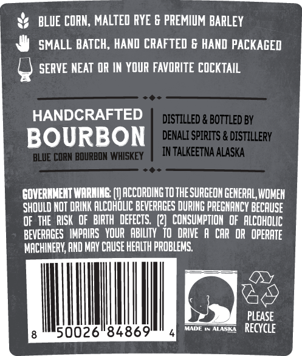
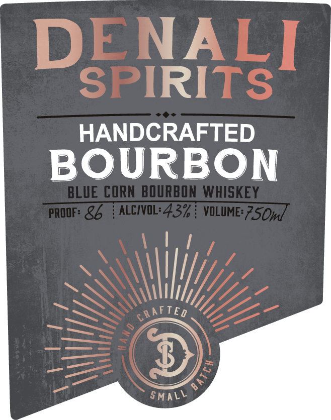

# TTB COLA Label Images - TTBID 26103001000782

**Brand Name:** DENALI SPIRITS

**Issue Date:** 04/15/2026

**Origin Code:** 4E

**Product Class/Type:** 141

**Source:** [TTB Public COLA Registry](https://ttbonline.gov/colasonline/viewColaDetails.do?action=publicFormDisplay&ttbid=26103001000782)

## Label Images

### Back Label

### Front Label

## Extracted Label Text

*Text extracted via OCR - may contain errors*

### Back Label

BLUE CORN; MALTED RYE & PREMIUM BARLEY
SMALL BATCH, HAND CRAFTED 6 HAND PACKAGED
SERVE NEAT OR IN YOUR FAVORITE COCKTAIL
HANDCRAFTED
DISTILLED & BOTTLED BY
BOURBON
DENALI SPIRITS & DISTILLERY
BLUE CORN BOURBDN WHISKEY
IN TALKEETNA ALASKA
GOVERMMENT WARMING
ACCORDING TOTHE SURGEON GENERAL, WOMEH
SHOULD NOT DRINK ALCOHOLIC BEVERAGES DURING PREGNANCY BECAUSE
OF THE  RISK  OF   BIRTH   DEFECTS   (2]   CONSUMPTIOH  Of  ALCOHOLIC
BEVERAGES   IMPAIRS   VOUR   ABILTY   TO  dRIVe
A CAR OR  OPERATE
MACHINERV; AHD MAY CAUSE HEALTH PROBLEMS:
PLEASE
50026"84869
lt
ALISK
RECYCLE

### Front Label

DENALI
SPIRITS
HANDCRAFTED
BOURBON
BLUE CORN BQURBON WHISKEY
PROOF: &b
ALCIOL: 437
VOLIME 7SOm]
6RAFTEd
SmALL
3
