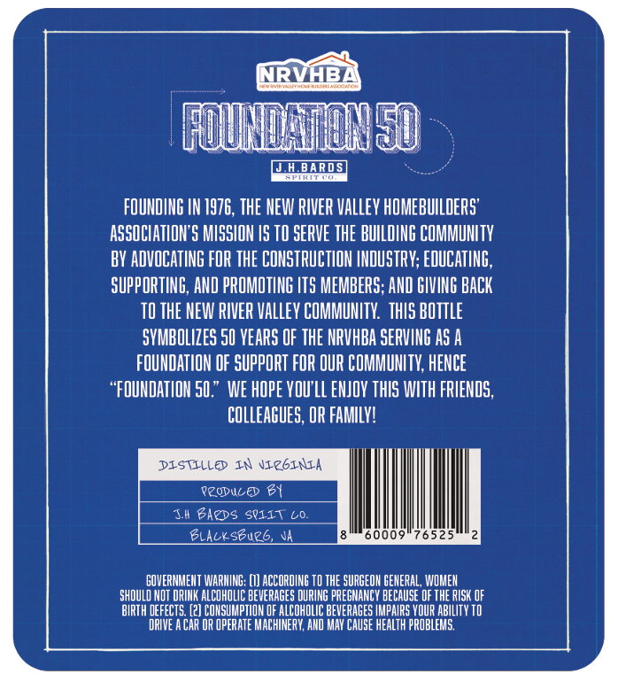
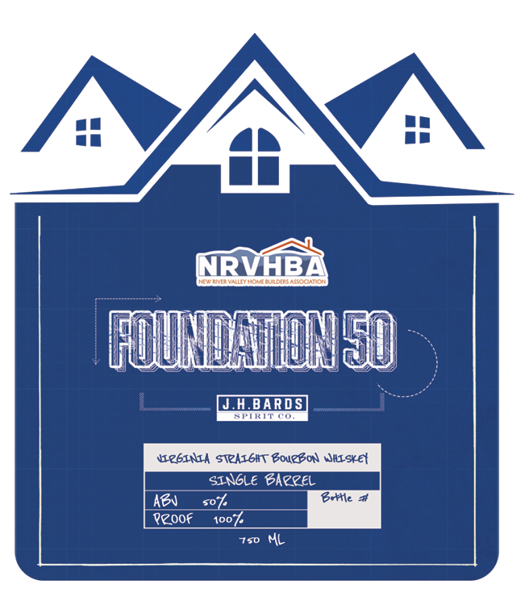

# TTB COLA Label Images - TTBID 26103001000812

**Brand Name:** FOUNDATION 50

**Issue Date:** 04/14/2026

**Origin Code:** 05

**Product Class/Type:** 101

**Source:** [TTB Public COLA Registry](https://ttbonline.gov/colasonline/viewColaDetails.do?action=publicFormDisplay&ttbid=26103001000812)

## Label Images

### Back Label

### Front Label

## Extracted Label Text

*Text extracted via OCR - may contain errors*

### Back Label

NRVHBB
[OUMMMDL
JHBARDSL
PIKIT"0
FOUNDING IN 1976, THE MEW RIVER Valley HOMEBUILDERS'
ASSOCLATLON"S MISSION /S TO SERVE THE BUILDING COMMUHITY
BY ADVOCATING FOR THE CONSTRUCTION IHOUSTRY; EDUCATING,
SUPPORTING, AND PROMOTING LTS MEMBERS; AND GIVING BACK
TO THE NEW RIVER VaLLeY COMMUNITV   ThIS bOTTLE
SVMBOLIZES 5U VEARS OF THE NRVHBA SERVING As A
FOUNDATION OF SuppORT FOR OUR COMMUNITK, HENCE
"FOUNDATIOH 50." WE hOpe VOULL ENJOV ThIS WITH FRIENDS,
CuLLeagues; OR FAMILV!
DISTILLE In JICGINIA
pzobule 61
Ii Bazds
SVIIT
Lu:
Blalkseurb,
0009'
76525
COVERHMEHT WARIING;
ACCORDING TO THE SURGEOH CEMERAL, WOMEH
shduLD NOT DRIHK ALCOHOLIC BEVERAGES DURING PRECMANCY BECAUSE F THE RISK OF
BIRTH DEFECTS. [2] COHSUMPTION OF AlCOhOLIC BEVERAGES IMpaIRS YOUR ABILITV TD
DRIVE A CAR OR OPERATE MACHINERY;, AHD MAY CAUSE healTh pROBLEMS

### Front Label

NRVAB
NLY RML YALL
Aocla
1d
JHBARDS
JWTCU
UEbINIA STZAIbHT Bou/g04 JHLskel
SINGLE Garzel
Azn
soz
B+e
Peoof
1007
750
AL
