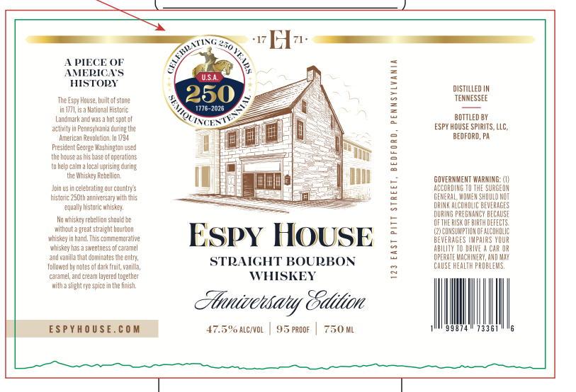

# TTB COLA Label Images - TTBID 26103001000837

**Brand Name:** ESPY HOUSE

**Fanciful Name:** ANNIVERSARY EDITION

**Issue Date:** 04/14/2026

**Origin Code:** 39

**Product Class/Type:** 101

**Source:** [TTB Public COLA Registry](https://ttbonline.gov/colasonline/viewColaDetails.do?action=publicFormDisplay&ttbid=26103001000837)

## Label Images

### Label 1

## Extracted Label Text

*Text extracted via OCR - may contain errors*

**Detected Proof:** 95

### Label 1

A PIECE OF
AMERICA’S
HISTORY

Te sy House, tof tne
in sa National istre
Lanark and wast spot of
ctvityinPemsyana ding the
American Reval In 98
Present George Washington used
the hous as his base of aperatons
tahel calm local psn cing
the hse Rebelo,
Joinusincaleratngourcauteys
istre 50t ania with his
qa strc whiskey
awh rebelion sand be
that reat stag bouton
ise inh This commenratve
wise has sete of creel
availa hat éninates teeny,
follow by oes of ark ut, ania,
‘arama and ream ayeed peter
witha ighty spice inthe ish,

ESPYHOUSE.COM

ESPyY HOUSE

STRAIGHT BOURBO!
WHISKEY

Atanivcwsaly Eidilim

7.5% aLcivoL | 95 PRooF | 750 ML

123 EAST PITT STREET, BEDFORD, PENNSYLVANIA

DisTiLLED IN
TENNESSEE
BOTTLED BY

SPY HOUSE SPIRITS, LC,
BEDFORD, PA

GOVERNMENT WARNING ()
ACCORDING 10 THE SURGEON
GENERAL WOMEN SHOULO NOT
RING ACONOUE BEVERAGES
DURING PREGNANCY BECAUSE
DFTHE RIS BRT DEFECTS,
(a)cOuSuMPTON oF aLcoHOLIC
BEVERAGES IMPAIRS YOUR
ABILITY TO ORWVE A CAR OR
OPERATE NOCHIERY, AND MAE
CAUSE REAL PROBLEMS,

473381
