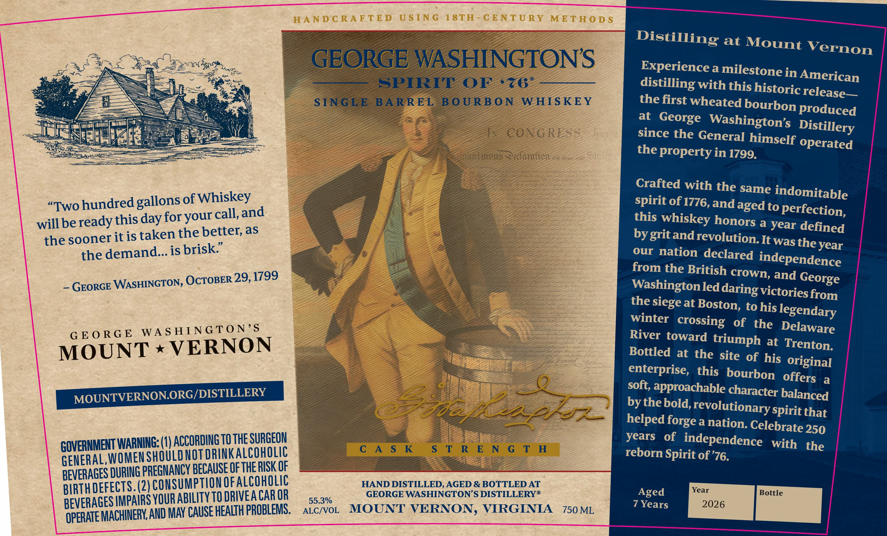

# TTB COLA Label Images - TTBID 26104001000135

**Brand Name:** GEORGE WASHINGTON'S

**Issue Date:** 04/14/2026

**Origin Code:** 05

**Product Class/Type:** 141

**Source:** [TTB Public COLA Registry](https://ttbonline.gov/colasonline/viewColaDetails.do?action=publicFormDisplay&ttbid=26104001000135)

## Label Images

### Label 1

## Extracted Label Text

*Text extracted via OCR - may contain errors*

**Detected Proof:** 110.6
**Detected Age:** 7 Years

### Label 1

HAND C RAFTE D
U $ I N G
1 8TH
CENTU RY METHO D $
Distilling
at
Mount Vernon
Os4
GEORGE WASHINGTONS
Experience a milestone in_
SPIRIT
OF
676
distilling withthisbostericAelezican
S INGLE
BARREL
B O URB O N
WHIS KEY
thefirst wheated bousbi peleuse d
at
George
produced
Washingtons
CONG RESS;
Jk:;
since the General himself
015
ecfarafton
the property in 1799.
operated
Crafted with the same
"Two hundred
of Whiskey
spiritof1776,andaged to
indomitable
will be ready this day for
call,
this whiskey hodoged pperfettied
the sooner it is taken the better; as
bygritandrevolution It
defined
the demand_ is brisk"
our nation declared
was the year
from the British crown;
independence
OCTOBER 29,1799
and
GEORGE WASHINGTON,
Washingtonled
victories,
the siege at Boston; to his =
from
winter
of
the
legendary
G E 0 R G E
WA S HING TO N'S
River toward
Delaware
VERNON
triumph at Trenton:
MOUNT
Bottled at the site of his
original
enterprise,  this   bourbon  offers
a
MOUNTVERNON ORG/DISTILLERY
soft approachable character balanced
67548
by the bold,_
revolutionary spiritthat
helped
a
nation: Celebrate 250
GOVERHMEHTWARHIG: (WV ACCORDIGTOtHE SURGEON
years
of
independence
with
the
GENERAL, WomenShQULDNotDRGEKA CohOLIE
C A $ K
S T R E N G T H
reborn Spirit of'76.
BEVERAGES DURING PReGMANCY BeCAUSE @F THERUSK QF
BrThdefEcTS: (ZiCOMSuMpTIOMOeALCOHOLG
HAND DISTILLED, AGED & BOTTLED AT
Year
IMPAIRS YOUR ABILITY TQ DRIVEA CAR OR
55.3%
GEORGE WASHINGTON S DISTILLERYO
Aged
Bottle
BEVERAGES L
AND May CAUSE HEALTH PROBLEMS.
ALC/VOL
MOUNT VERNON; VIRGINIA
750 ML
7 Years
2026
OPERATE MACHINERK;
Distillery
S5c
gallons
and
your
George
daring
crossing
forge
