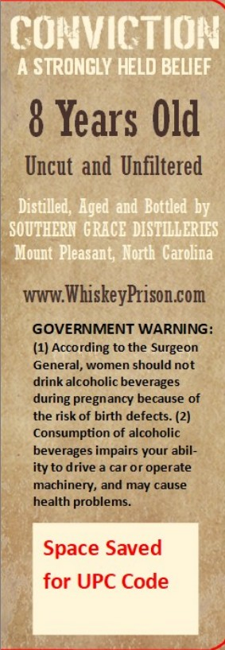
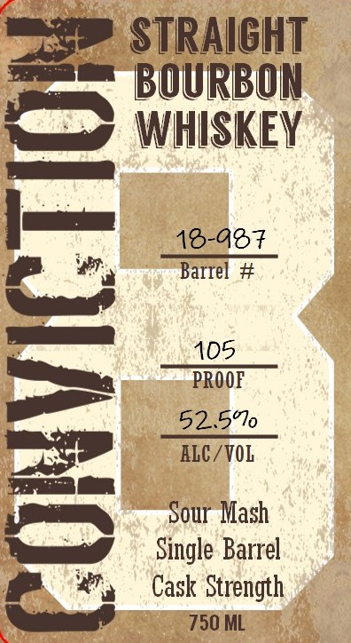

# TTB COLA Label Images - TTBID 26104001000171

**Brand Name:** CONVICTION

**Fanciful Name:** 8

**Issue Date:** 04/15/2026

**Origin Code:** 35

**Product Class/Type:** 101

**Source:** [TTB Public COLA Registry](https://ttbonline.gov/colasonline/viewColaDetails.do?action=publicFormDisplay&ttbid=26104001000171)

## Label Images

### Back Label

### Front Label

## Extracted Label Text

*Text extracted via OCR - may contain errors*

**Detected Age:** 8 Years

### Back Label

COnvictIon
A STRONGLY HELD BELIEF
8 Years Old
Uncut and Unfiltered
Distilled, Aged'and' Bottled by
SOUHERN  GRACE  DISTILLERIES
Mount Pleasant  North   Carolina
WWW:
WhiskeyPrison com
GOVERNMENT WARNING:
(1) According to the Surgeon
General, women should not
drink alcoholic beverages
during pregnancy because of
the risk of birth defects: (2)
Consumption of alcoholic
beverages impairs your abil-
ity to drive a car or operate
machinery, and may cause
health problems__
Space Saved
for UPC Code

### Front Label

P STRAIGHT
== BOURBON
fem WHISKEY

16-407
| al ary Barrel #

\ eed

pe LAOS
——l 52.5%
ws ALC/VOL
imi

\ * sour Mash
= Single Barrel
BR, Cask Strength

750 ML
