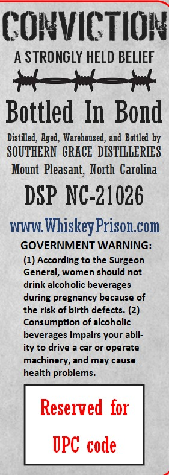
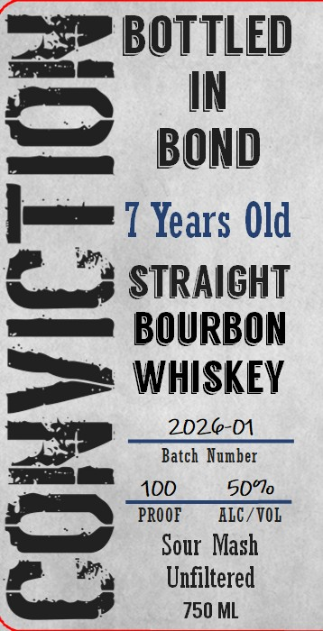

# TTB COLA Label Images - TTBID 26104001000177

**Brand Name:** CONVICTION

**Fanciful Name:** BOTTLED IN BOND

**Issue Date:** 04/17/2026

**Origin Code:** 35

**Product Class/Type:** 119

**Source:** [TTB Public COLA Registry](https://ttbonline.gov/colasonline/viewColaDetails.do?action=publicFormDisplay&ttbid=26104001000177)

## Label Images

### Back Label

### Front Label

## Extracted Label Text

*Text extracted via OCR - may contain errors*

### Back Label

COHVICTIOH
A STRONGLY HELD BELIEF
Bottled In  Bond
Distiled, Aged, Warehoused, and  Bottled by
SOUTHERN   GRACE  DISTILLERIES
Mount  Pleasant; North Carolina
DSP NC-21026
WWW;
WhiskeyPrison Com
GOVERNMENT WARNING:
(1) According to the Surgeon
General, women should not
drink alcoholic beverages
during pregnancy because of
the risk of birth defects. (2)
Consumption of alcoholic
beverages impairs your abil-
ity to drive
car Or
operate
machinery, and may cause
health problems_
Reserved  for
UPC code

### Front Label

=> BOTTLED

om’

IN

uu

Le

BOND

T Years Old

Canad STRAIGHT

mame BOURBON

poe WHISKEY

Batch Number

2026-01

=

ana

4

0’

Fi oe \ PROOF = ALC /VOL

.

Sour Mash

Unfiltered

-

a,

750 ML
