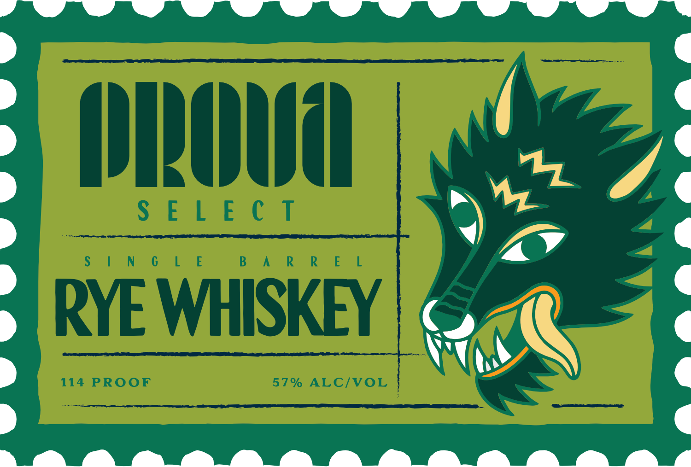
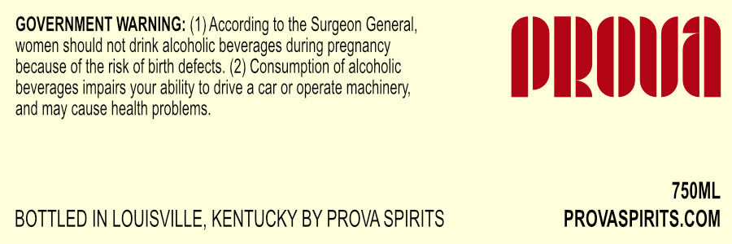

# TTB COLA Label Images - TTBID 26104001000204

**Brand Name:** PROVA

**Issue Date:** 04/15/2026

**Origin Code:** 22

**Product Class/Type:** 142

**Source:** [TTB Public COLA Registry](https://ttbonline.gov/colasonline/viewColaDetails.do?action=publicFormDisplay&ttbid=26104001000204)

## Label Images

### Label 1

### Label 2

## Extracted Label Text

*Text extracted via OCR - may contain errors*

*1 image(s) excluded: text did not meet readability threshold*

### Label 2

GOVERNMENT WARNING: (1) According to the
Ieon General,
women should not drink alcoholic beverages during pregnancy
because of the risk of birth defects. (2) Consumption of alcoholic
(ILOHUAL
beverages impairs your ability to drive a car or operate machinery
and may cause health problems.
750ML
BOTTLED IN LOUISVILLE, KENTUCKY BY PROVA SPIRITS
PROVASPIRITS.COM
Surge
