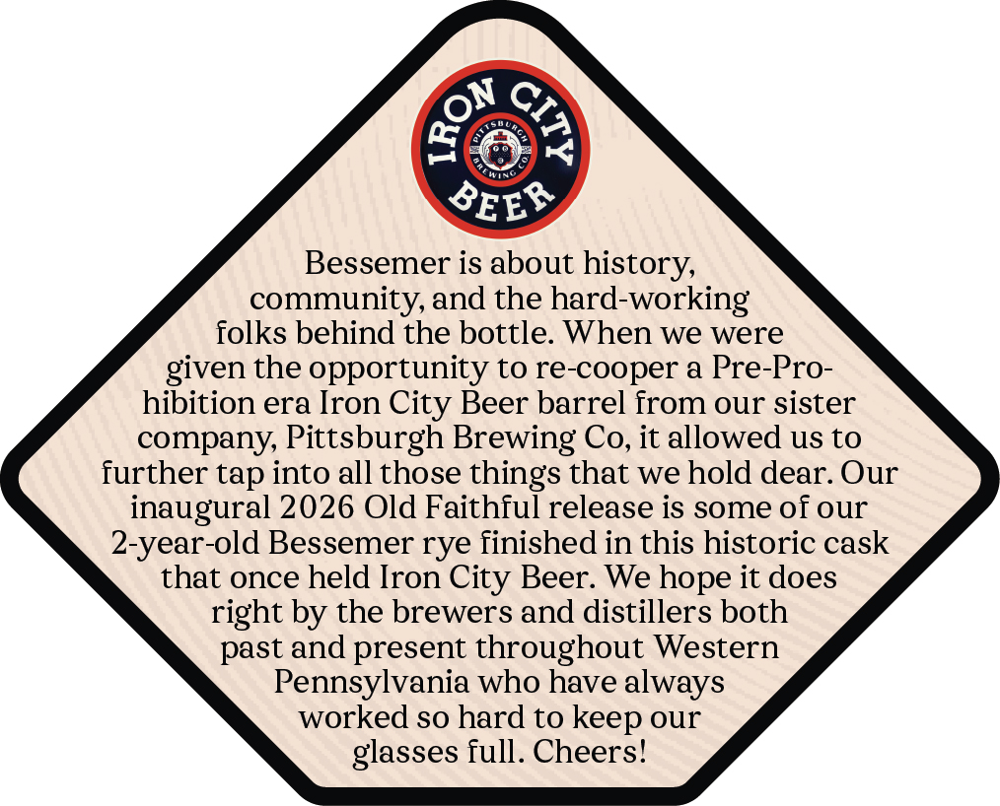
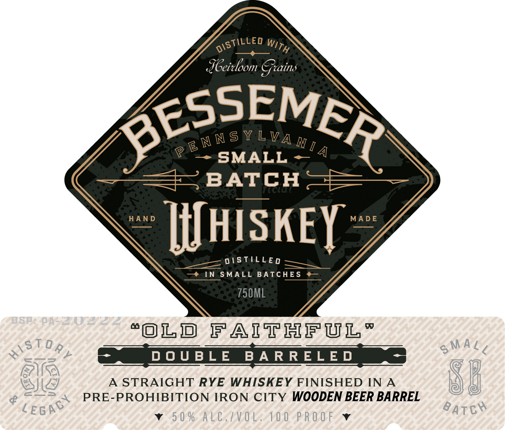
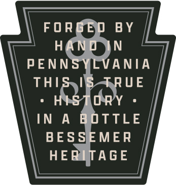

# TTB COLA Label Images - TTBID 26104001000398

**Brand Name:** BESSEMER

**Fanciful Name:** OLD FAITHFUL

**Issue Date:** 04/23/2026

**Origin Code:** 39

**Product Class/Type:** 102

**Source:** [TTB Public COLA Registry](https://ttbonline.gov/colasonline/viewColaDetails.do?action=publicFormDisplay&ttbid=26104001000398)

## Label Images

### Back Label

### Front Label

### Label 2

## Extracted Label Text

*Text extracted via OCR - may contain errors*

### Back Label

Bessemer is about history,
community, and the hard-working
folks behind the bottle. When we were
given the opportunity to re-cooper a Pre-Pro-
hibition era Iron City Beer barrel from our sister
company, Pittsburgh Brewing Co, it allowed us to
further tap into all those things that we hold dear. Our
inaugural 2026 Old Faithful release is some of our
2-year-old Bessemer rye finished in this historic cask
that once held Iron City Beer. We hope it does
right by the brewers and distillers both
past and present throughout Western
Pennsylvania who have always
worked so hard to keep our
glasses full. Cheers!

### Front Label

TILLED pz
oe ue
dbeitloom Grains
2W® N SYL VA INE ,

m =-—-=SMALL ~
== BATCH =
HAND it | S KEY ~
= OISTILLED ~
—* IN SMALL BATCHES ¢@¢—
750ML
“OLD FAITHFUL”
DOUBLE BARRELED
A STRAIGHT RYE WHISKEY FINISHED INA
PRE-PROHIBITION IRON CITY WOODEN BEER BARREL
v v

### Label 2

FOR

BY

PENN

ANIA

THI

UE

INA

TUE

BESSEMER

HE

AGE
