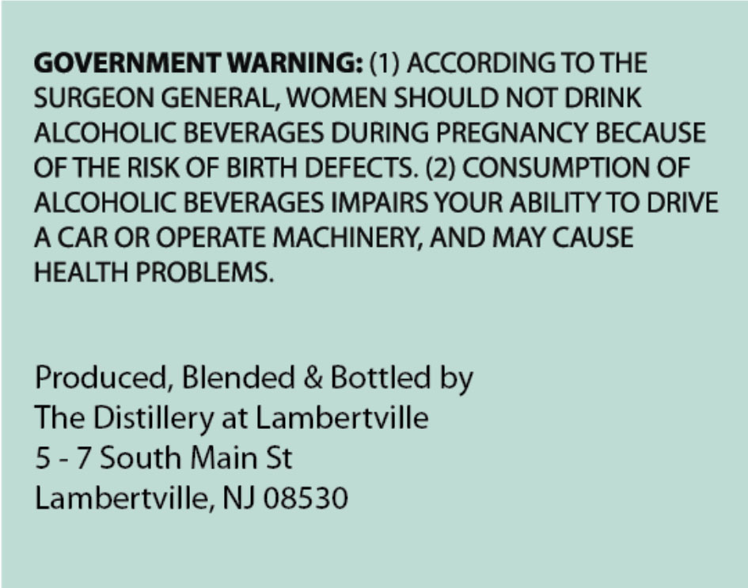
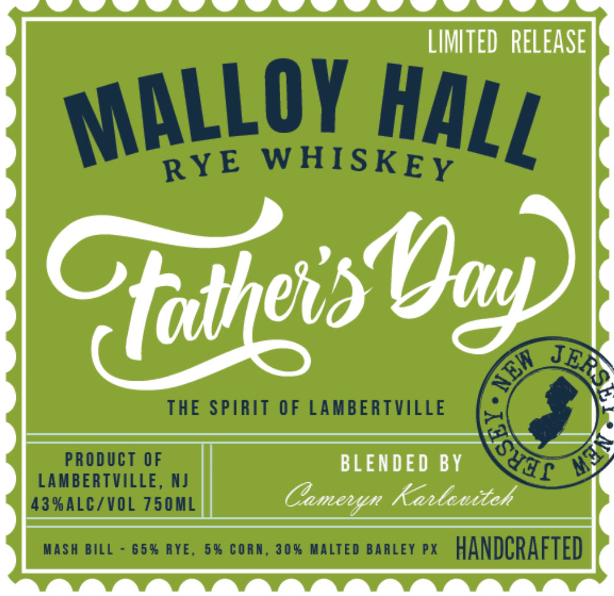

# TTB COLA Label Images - TTBID 26104001000435

**Brand Name:** MALLOY HALL RYE WHISKEY

**Issue Date:** 04/15/2026

**Origin Code:** 03

**Product Class/Type:** 142

**Source:** [TTB Public COLA Registry](https://ttbonline.gov/colasonline/viewColaDetails.do?action=publicFormDisplay&ttbid=26104001000435)

## Label Images

### Back Label

### Label 1

## Extracted Label Text

*Text extracted via OCR - may contain errors*

**Detected Proof:** 86

### Back Label

GOVERNMENT WARNING: (1) ACCORDING TO THE

SURGEON GENERAL, WOMEN SHOULD NOT DRINK

ALCOHOLIC BEVERAGES DURING PREGNANCY BECAUSE

OF THE RISK OF BIRTH DEFECTS. (2) CONSUMPTION OF

ALCOHOLIC BEVERAGES IMPAIRS YOUR ABILITY TO DRIVE

A CAR OR OPERATE MACHINERY, AND MAY CAUSE

HEALTH PROBLEMS.

Produced, Blended & Bottled by

The Distillery at Lambertville

5 -7 South Main St

Lambertville, NJ 08530

### Label 1

LIMITED   RELEASE
WHISKEY
Qatheist
THE SPIRIT OF LAMBERTVILLE
PRODUCT OF
BLENDED BY
LAMBERTVILLE, NJ
43 %ALCZVOL 750ML
Camenan Kanloviteh
MaSh BILL
65% RYE,
6 % CORA; 30% MALTED BARLEY PX
handCrafted
MALLOY
HALL
RYE
NJay)
JERS
NEW
YIf
