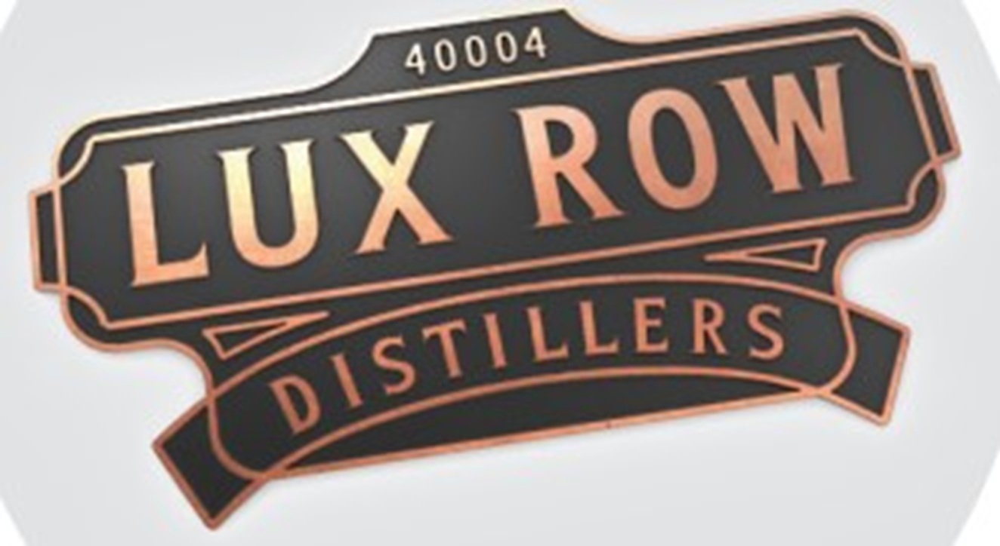
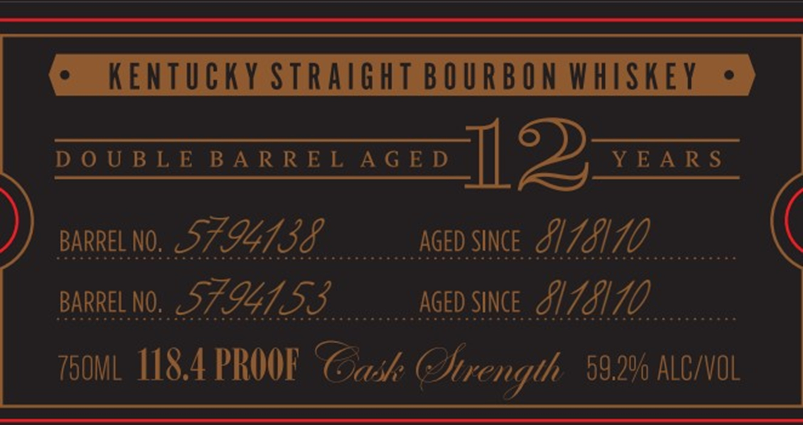
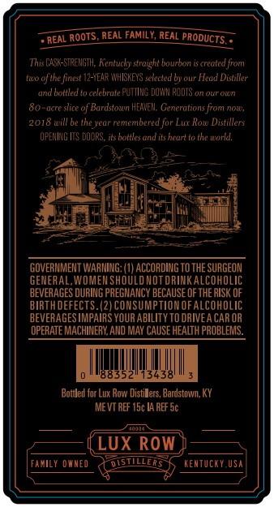
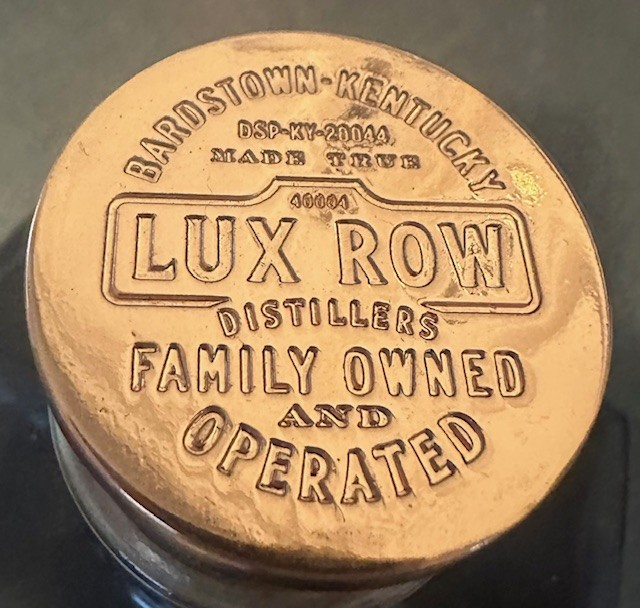
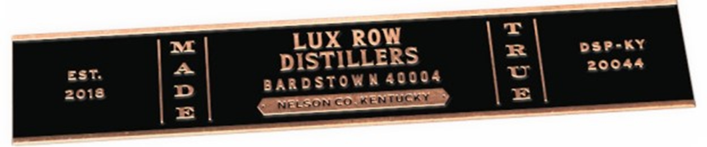

# TTB COLA Label Images - TTBID 26104001000588

**Brand Name:** LUX ROW DISTILLERS

**Issue Date:** 04/15/2026

**Origin Code:** 22

**Product Class/Type:** 102

**Source:** [TTB Public COLA Registry](https://ttbonline.gov/colasonline/viewColaDetails.do?action=publicFormDisplay&ttbid=26104001000588)

## Label Images

### Label 1

### Label 2

### Label 3

### Label 4

### Label 5

## Extracted Label Text

*Text extracted via OCR - may contain errors*

*2 image(s) excluded: text did not meet readability threshold*

**Detected Proof:** 118.4

### Label 2

e

KENTUCKY STRAIGHT BOURBON WHISKEY =

eee eee ee

BARRELNO. SAUI IL

aceo since S/ 7417

CEM OSHA S OAC ESA ES UTS TAOS MESS ReOEUARALASAOR ARES P EHEC OCHRE ESS ESUCENER EACH O AEE DAS

BARRELNO. 97-4755

aceo since IZA

750ML 118.4 PROOF Cie Siength 59.26 ALC/VOL

### Label 3

REAL
REAL FAMILY, REAL
PRODUCTS
This CASK-STREHGTH, Kentucky straight bourbon is created from
Iio of te fertest 12-YEAR IVHISKEYS setecled by our Head Distiller
bonled to celebrate PUTIIIG DOXM RCTS on Qur Oin
80-acre slice of Bardstown HEAVEH Generations from noi,
2018 will be Ihe Jear remembered for Lux Kow Distillers
OFERIRG ITS DOORS, #ls Dottles arid its heact to the worid.
GOVERMMENT WAANING:
ACCORDING To thE SURGEON
GEMERAL,WNOMEN ShOULD NOT ORINK ALcohoLic
BEVERAGES DURING PREGMANC
BECAUSE OF THE RISK OF
BIRTH DEFECTS.(2) COMSUMPTIOMOF
COhOLIC
BEVERAGES IMPAIRS YOUR ABILITY TO ORIVEA CAR OR
OPERATE MACHIMERY, AND MAY CAUSE HEaLTh PROBLEMS.
Bouded for Lux Row Distilers, Bardstowvn;
Me VT REF 1Sc L4 REF Sc
Auuua
LUX ROw
family ownEd
DistilLERS
renTcKY Usa
rooTS.

### Label 4

DSP-K1-20044 ,
SIADE
83c.
aodo
Lux Rom
6OSt
FAMOLy OCNED
AND
@PeraTeD
ardstorjg_
~rentuckY
Llbrs
