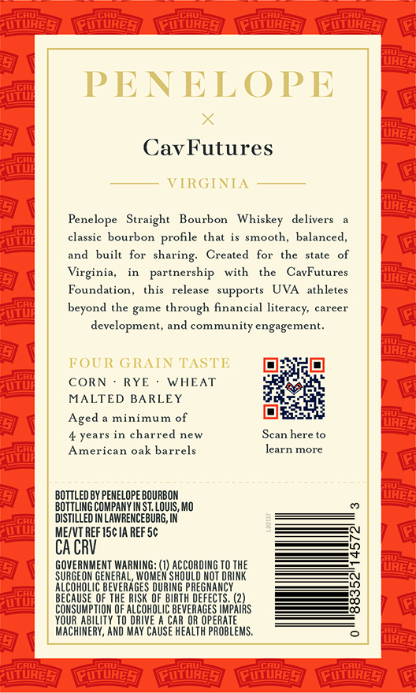
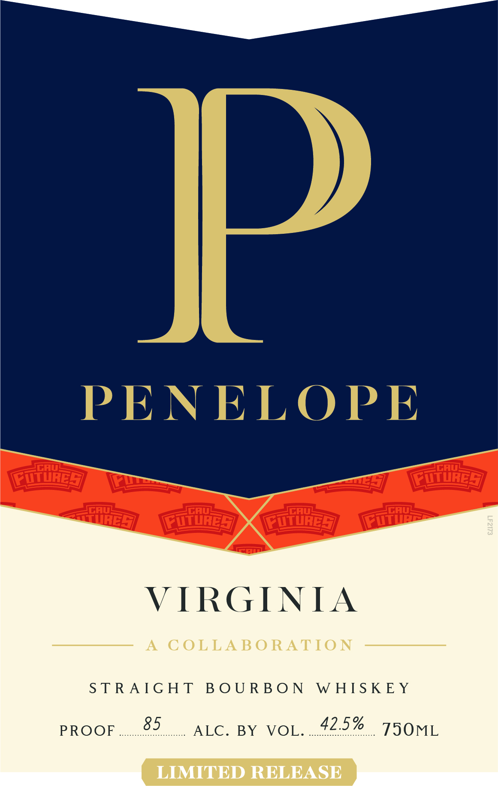
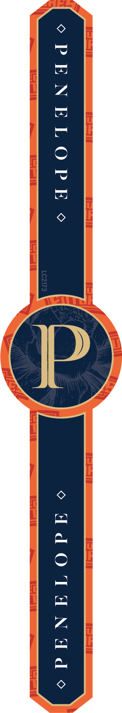

# TTB COLA Label Images - TTBID 26104001000619

**Brand Name:** PENELOPE

**Issue Date:** 04/15/2026

**Origin Code:** 29

**Product Class/Type:** 101

**Source:** [TTB Public COLA Registry](https://ttbonline.gov/colasonline/viewColaDetails.do?action=publicFormDisplay&ttbid=26104001000619)

## Label Images

### Back Label

### Front Label

### Label 3

## Extracted Label Text

*Text extracted via OCR - may contain errors*

*1 image(s) excluded: text did not meet readability threshold*

**Detected Proof:** 85
**Detected Age:** 4 Years

### Back Label

PENELOPE
CavFutures
VIRGINIA
Penelope   Straight
Bourbon
Whiskey
delivers
classic bourbon
that is smooth, balanced,
and
built   for
Created
for
the
state
Virginia,
partnership
with
the
CavFutures
Foundation ,
this
release
supports
UVA
athletes
beyond the game through financial
career
development, and community engagement.
FOUR GRAIN TASTE
CORN
RYE
WHEAT
MALTED BARLEY
Aged
minimum of
4 years in charred new
Scan here t0
American oak barrels
learn more
BOTTLED BY PENELOPE BOURBOM
BOTTLING COMPANY IM ST, LOuIS, MO
distiLLeD IN LAWRENCEBURG, IN
ME/VT REF I5c IA REF5c
CA CRV
GOVERNMENT MARNING
PGeQbQho
TO THE
SURGEOM GENERAL, WOMEM
NOT DRINK
BEVERAGES DURING PREGNANCY
EECouEd5
OF THE RISK QF BIRTH DEFECTS: (2)
CONSUMPTIOM OF AlCohOLIC BeveRAGES IMPAIRS
YOUR AbilITY TO dRIVE
CAR OR OPERATE
MACHINERY, AND MAY CAUSE HeALTH pROBLEMS .
Futures
@uture5
Profile
sharing:
literacy.

### Front Label

VIRGINIA

A COLLABORATION

STRAIGHT BOURBON WHISKEY

PROOF

85

ALC. BY VOL....42:

TSOML

LIMITED RELEASE
