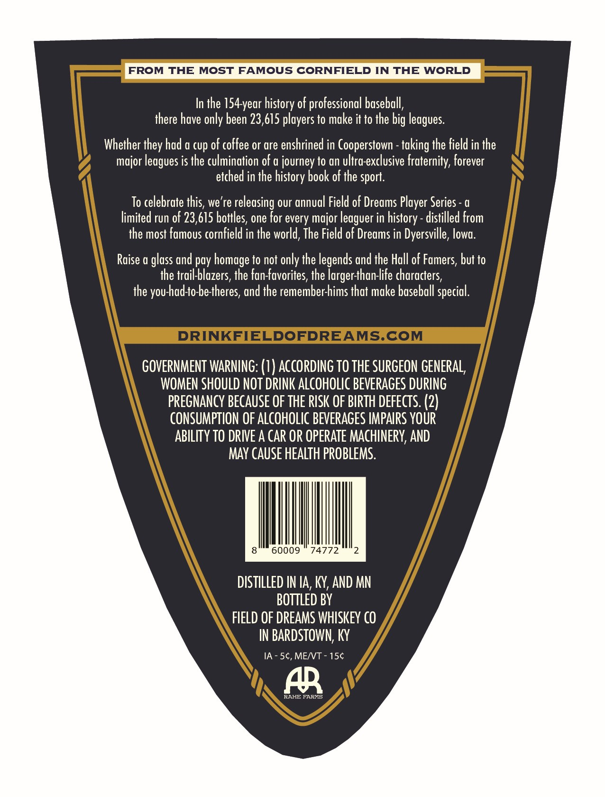
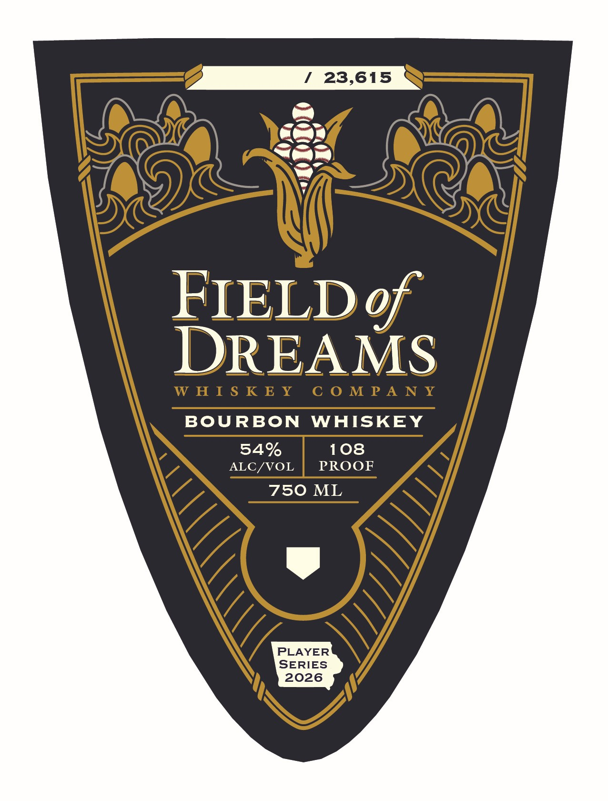

# TTB COLA Label Images - TTBID 26104001000677

**Brand Name:** FIELD OF DREAMS

**Issue Date:** 04/15/2026

**Origin Code:** 22

**Product Class/Type:** 141

**Source:** [TTB Public COLA Registry](https://ttbonline.gov/colasonline/viewColaDetails.do?action=publicFormDisplay&ttbid=26104001000677)

## Label Images

### Back Label

### Front Label

## Extracted Label Text

*Text extracted via OCR - may contain errors*

*1 image(s) excluded: text did not meet readability threshold*

### Back Label

FROM THE
MOST FAMOUS CORNFIELD IN THE
WORLD
In the 154-year history of professional baseball,
there have only been 23,615 players to make it to the big
Whether they had a cup of coffee or are enshrined in Cooperstown
the field in the
major
is the culmination of a journey to an ultra-exclusive fraternity, forever
etched in the history book of the sport.
To celebrate this, we're releasing our annual Field of Dreams Player Series
limited run of 23,615 bottles, one for every major leaguer in
distilled from
the most famous cornfield in the world, The Field of Dreams in Dyersville, lowa:
Raise a glass and pay homage to not only the legends and the Hall of Famers, but to
Ihe trail-blazers, the fan-favorites, the largerthan-life characters
the you-had-to-betheres, and the remember-hims that make baseball special
DRINKFIELDOFDREAMS.COM
GOVERNMENT WARNING: (1 ) ACCORDING TO THE SURGEON GENERAL,
WOMEN SHOULD NOT DRINK ALCOHOLIC BEVERAGES DURING
PREGNANCY BECAUSE OF THE RISK OF BIRTH dEfEcTS: (2)
CONSUMPTION OF ALCOHOLIC BEVERAGES IMPAIRS YOUR
ABILITY TO DRIVE A CAR OP OPERATE MAcHINERY, AND
MAY CauSe HEALTH PROBLEMS.
60009
74772
DISTILLED IN IA, KY,AND MN
BOTTLeD BY
FIELD OF DREAMS WHISKEY €0
IN BARDSTOWN; KY
IA - 5c, MEIVT
15c
AR
RAHE FaRXS
leagues
taking
leagues
history -
