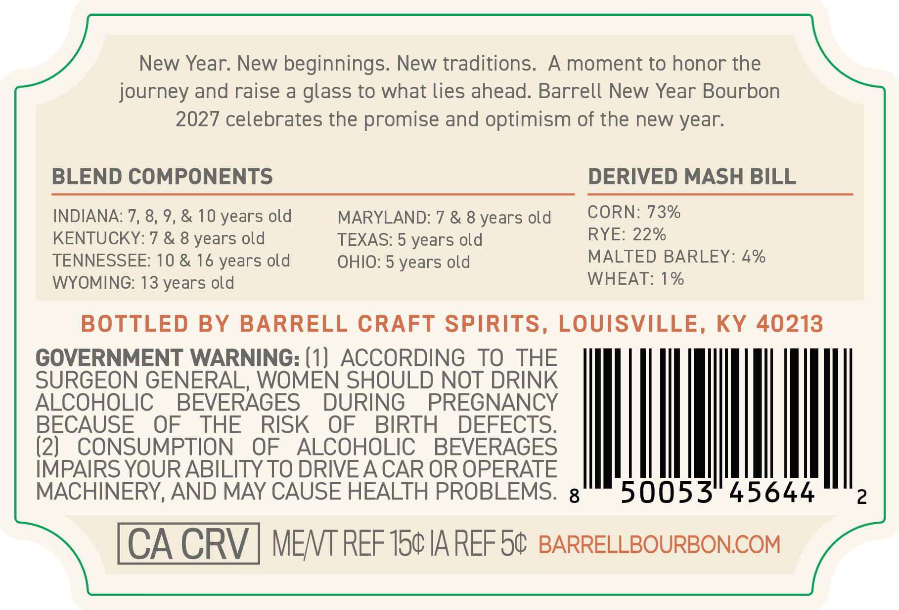
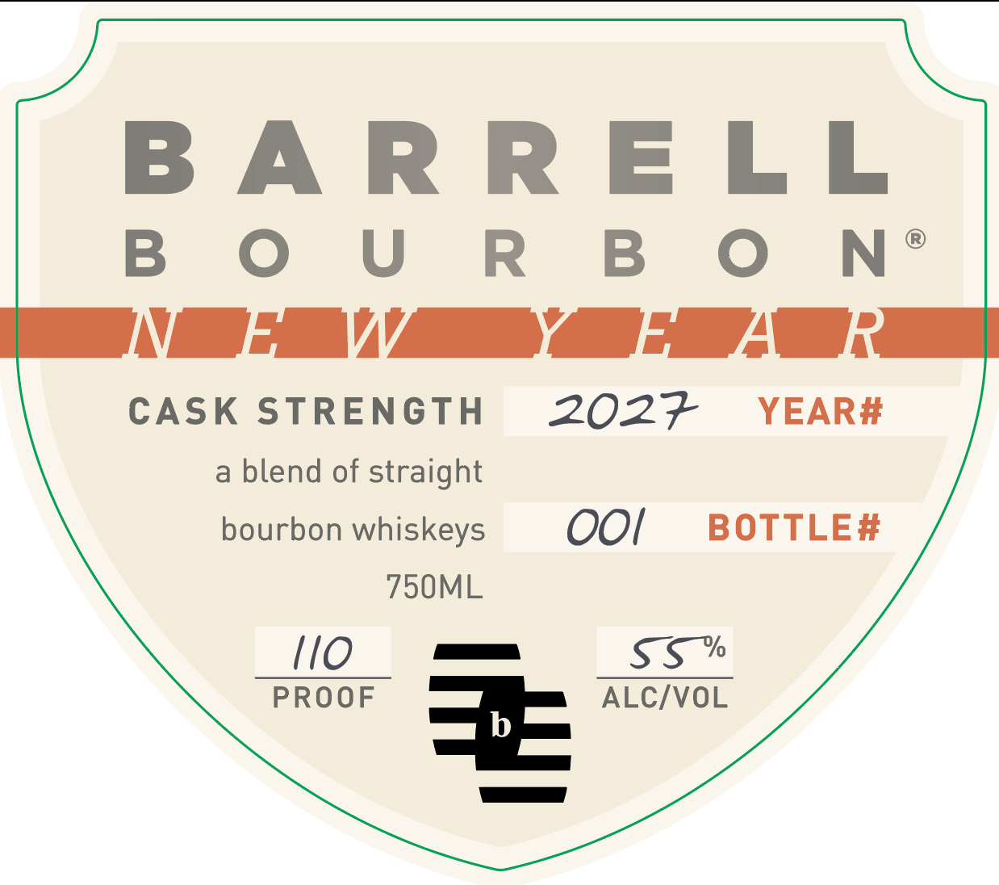
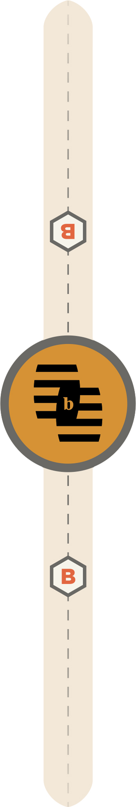

# TTB COLA Label Images - TTBID 26104001000713

**Brand Name:** BARRELL BOURBON

**Issue Date:** 04/15/2026

**Origin Code:** 22

**Product Class/Type:** 121

**Source:** [TTB Public COLA Registry](https://ttbonline.gov/colasonline/viewColaDetails.do?action=publicFormDisplay&ttbid=26104001000713)

## Label Images

### Back Label

### Front Label

### Label 3

## Extracted Label Text

*Text extracted via OCR - may contain errors*

*1 image(s) excluded: text did not meet readability threshold*

**Detected Age:** 10 Years

### Back Label

New Year. New beginnings. New traditions. A moment to honor the

journey and raise a glass to what lies ahead. Barrell New Year Bourbon

2027 celebrates the promise and optimism of the new year.

BLEND COMPONENTS

DERIVED MASH BILL

CORN: 73%

INDIANA: 7, 8, 9, & 10 years old

MARYLAND: 7 & 8 years old

YE: 22%

KENTUCKY: 7 & 8 years old

TEXAS: 5 years old

MALTED BARLEY: 4%

TENNESSEE: 10 & 16 years old

OHIO: 5 years old

WYOMING: 13 years old

WHEAT: 1%

BOTTLED BY BARRELL CRAFT SPIRITS, LOUISVILLE, KY 40213

GOVERNMENT WARNING: (1) ACCORDING TO THE

SURGEON GENERAL, WOMEN SHOULD NOT DRINK

ALCOHOLIC BEVERAGES DURING PREGNANCY

BECAUSE OF THE RISK OF BIRTH DEFECTS

(2) CONSUMPTION OF ALCOHOLIC BEVERAGES

IMPAIRS YOUR ABILITY TO DRIVE A CAR OR OPERATE

|

Ml

MACHINERY, AND MAY CAUSE HEALTH PROBLEMS. g

50053

A CRV | MENT REF 15¢ IA REF 5¢ BARRELLBOURBON.COM

### Front Label

BARRELL

B OU R B O N®

NF WwW yf Aik

CASK STRENGTH

2027 YEAR#

a blend of straight

bourbon whiskeys

OO!

BOTTLE#

750ML

Sss*

PROOF =>= ALC/VOL
