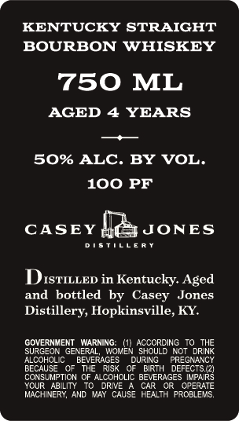
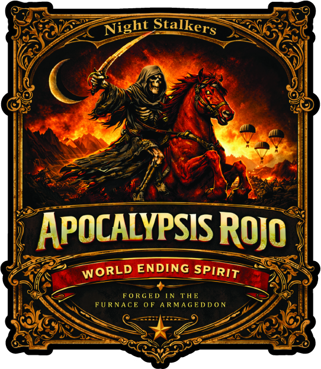

# TTB COLA Label Images - TTBID 26104001000763

**Brand Name:** CASEY JONES DISTILLERY

**Issue Date:** 04/21/2026

**Origin Code:** 22

**Product Class/Type:** 101

**Source:** [TTB Public COLA Registry](https://ttbonline.gov/colasonline/viewColaDetails.do?action=publicFormDisplay&ttbid=26104001000763)

## Label Images

### Back Label

### Front Label

## Extracted Label Text

*Text extracted via OCR - may contain errors*

**Detected Proof:** 100
**Detected Age:** 4 Years

### Back Label

KENTUCKY STRAIGHT
BOURBON WHISKEY
750 ML
AGED
4 YEARS
50% ALC. BY VOL.
100 PF
CASEY
JONES
TSTILLE R *
DISTILLED in Kentucky. Aged
and bottled
by Casey
Distillery, Hopkinsville, KY
GOVERNMENT
MARNING:
(1 ACCORDING
T0 THE
SURGEON GENERAL
WONEN SHOULD KOT  DRINK
ALCOHOLIC
BEVERAGES
DURING
PREGNANCY
BECAUSE
THE
RISK
BIRTH
DEFECTS
EGPSIR}
CONSUMPTION OF ALCOHOLIC BEVERAGES
YOUR   ABILITY
DRIVE
CAR
OPERATE
MACHINERY, AND MAY CAUSE HEALTH PROBLEMS:
Jones

### Front Label

APOcALYPSIS ROjo
ENDING
FoRGKD
IN THK
FURNACE
0F
A RMAGED D 0 N
Stalkers
Night
WORLD
SPIRIT
