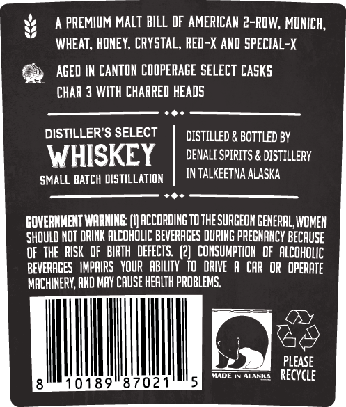
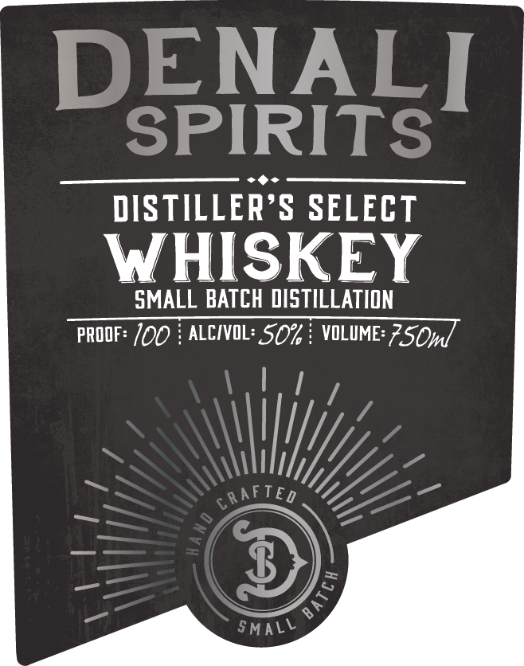

# TTB COLA Label Images - TTBID 26104001000773

**Brand Name:** DENALI SPIRITS

**Issue Date:** 04/15/2026

**Origin Code:** 4E

**Product Class/Type:** 140

**Source:** [TTB Public COLA Registry](https://ttbonline.gov/colasonline/viewColaDetails.do?action=publicFormDisplay&ttbid=26104001000773)

## Label Images

### Back Label

### Front Label

## Extracted Label Text

*Text extracted via OCR - may contain errors*

**Detected Proof:** 100

### Back Label

A PREMIUM MALT BILL OF AMERICAN 2-ROW, MUNICH,
WHEAT , HONEY, CrYSTAL, RED-X AND SPECIAL-X
AGED IN CANTON COOPERAGE SELECT CaSkS
CHAR 3 WITH CHARRED HEADS
DISTILLER'S SELECT
DISTILLED & BOTTLED BY
WHISKEY
DENALI SPIRITS & DISTILLERY
SMALL BATCH DISTILLATION
IN TALKEETNA ALASKA
GOVERMMENT WARHING
ACCORDING TOTHE SURGEON GENERAL, WOMEH
SHOULD NOT DRINK ALCOHOLIC BEVERAGES DURING PREGNANCY BECAUSE
OF THE   RISK   OF   BIRTH   DEFECTS   (2]  CONSUMPTION  of  Alcoholic
BEVERAGES   IMPAIRS   YOUR   ABILTy   t0  DRIVE
A CAR OR  OPERATE
MACHINERV; AHD MAV CAUSE HEALTH PROBLEMS.
PLEASE
Madt
ALASKA
REcyCle
0189
8702

### Front Label

DENALI
SPIRITS
DISTILLER'S SELECT
WHISKEY
SMALL BATCH DISTILLATION
PROOF: 100
ALCIVL: SO%
VOLUME: 7S0ml
6RAfTEd
SMALL
6
