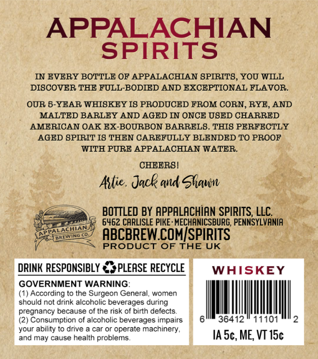
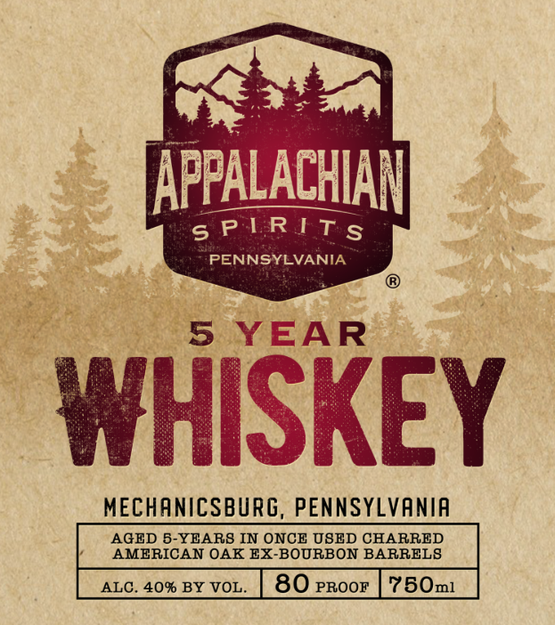

# TTB COLA Label Images - TTBID 26104001001001

**Brand Name:** APPALACHIAN SPIRITS

**Issue Date:** 04/16/2026

**Origin Code:** 39

**Product Class/Type:** 140

**Source:** [TTB Public COLA Registry](https://ttbonline.gov/colasonline/viewColaDetails.do?action=publicFormDisplay&ttbid=26104001001001)

## Label Images

### Back Label

### Front Label

## Extracted Label Text

*Text extracted via OCR - may contain errors*

### Back Label

APPALACHIAN
SPIRITS
IN EVERY BOTTLE OF APPALACHLAN SPIRITS,YOU WILL
DISCOVER THE FULL-BODIED AND EXCEPTIONAL FLAVOR_
OUR 5-YEAR WHISKEY I8 PRODUCED FROM CORN, RYE, AND
MALTED BARLEY AND AGED IN ONCE OSED CHARRED
AMERICAN OAK EX-BOURBON BARRELS. THIS PERFECTLY
AGED SPIRIT I8 THEN CAREFULLY BLENDED TO PROOF
WITH PURE APPALACHIAN WATER.
CHEERS |
Atie . Jack ad Shaun
BOTTLED BY APPALACHIAN SPIRITS, LLC
6462 CARLISLE PIKE: MECHANICSBURG, PENNSYLVANIA
ABCBREW COMISPIRITS
PRODUCT OF THE UK
DRINK RESPONSIBLY
PLEASE RECYCLE
WHISKEY
GOVERNMENT WARNING
(1) According to the Surgeon General, women
should not drink alcoholic beverages during
pregnancy because of the risk of birth defects
(2) Consumption of alcoholic beverages impairs
36412
11101
your ability to drive
car or operate
machinery,
and may cause health problems
IA Sc, ME; VT I5c

### Front Label

tiaiiee
APPALACHIAN

5S YEAR

WHISKE

MECHANICSBURG, PENNSYLVANIA

AGED 5-YEARS IN ONCE USED CHARRED
Y AMERICAN OAK EX-BOURBON BARRELS
