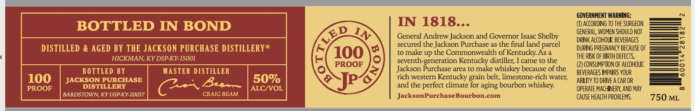
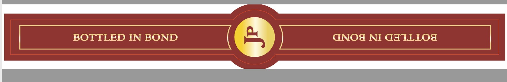

# TTB COLA Label Images - TTBID 26105001000149

**Brand Name:** JACKSON PURCHASE

**Issue Date:** 04/22/2026

**Origin Code:** 22

**Product Class/Type:** 111

**Source:** [TTB Public COLA Registry](https://ttbonline.gov/colasonline/viewColaDetails.do?action=publicFormDisplay&ttbid=26105001000149)

## Label Images

### Label 1

### Label 2

### Label 3

## Extracted Label Text

*Text extracted via OCR - may contain errors*

*1 image(s) excluded: text did not meet readability threshold*

**Detected Proof:** 100

### Label 1

PURCHASE
KENTUCKY STRAIGHT BOURBON WHISKEY
JACKSON

### Label 2

GOVERNMENT WARNING:
BOTTLED IN BOND
IN 1818..-
ACCORDInG TO thE SURGEON
GENERAL, WOMEN SHOULD NOT
N
General Andrew Jackson and Governor Isaac Shelby
DRINK ALcohovC BEvERAGES
DISTILLED & AGED BY THE JACKSON PURCHASE DISTILLERY@
secured the Jackson Purchase as the final land parcel
DuRING PREGNANCY BECAUSE OF
~
100
to make up the Commonwealth of Kentucky As
ThE RISK OF BIRTH DeFECTS
HICKMAN, KY DSP KY-15001
seventh-
~generation Kentucky distiller;
came t0 the
PROOF
CONSUMPTION OF ALcohouC
BOTTLED BY
MASTER DISTILLER
Jackson Purchase area to make
whiskey because of the
BEVERAGES IMPAIRS YOUR
8
100
JACKSON PURCHASE
50%
6
rich western Kentucky grain belt; limestone-rich water;
ABILITY TO DRIvE A CAR OR
PROOF
DISTILLERY
Beov~
ALC/VOL
and the
perfect climate for aging bourbon whiskey:
OPERATE MACHINERY, AND MAY
BARDSTOWN, KY DSP-KY-20037
CRAIG BEAM
JacksonPurchaseBourbon-com
CAUSE HEALTH PROBLEMS
750 ML
ED
IN
Jp~
