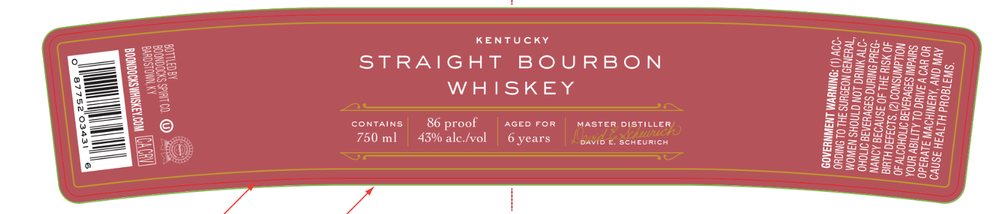
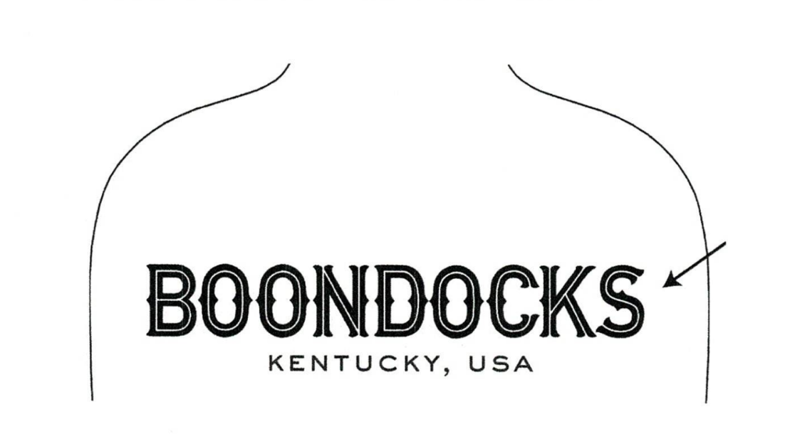
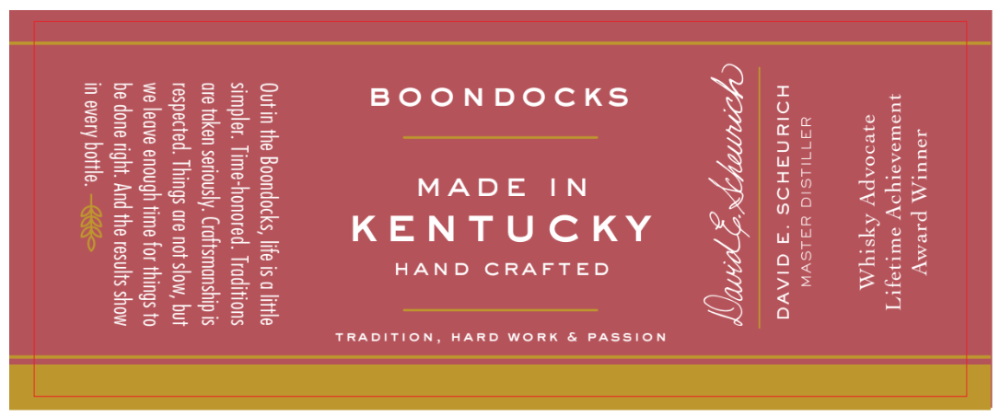

# TTB COLA Label Images - TTBID 26105001000193

**Brand Name:** BOONDOCKS

**Issue Date:** 04/15/2026

**Origin Code:** 22

**Product Class/Type:** 101

**Source:** [TTB Public COLA Registry](https://ttbonline.gov/colasonline/viewColaDetails.do?action=publicFormDisplay&ttbid=26105001000193)

## Label Images

### Front Label

### Label 2

### Label 3

## Extracted Label Text

*Text extracted via OCR - may contain errors*

*1 image(s) excluded: text did not meet readability threshold*

**Detected Proof:** 86
**Detected Age:** 6 Years

### Front Label

Seggsses=
Ss=SiS5ERe5,,
gezeesSse
7 SeLog<25
TUCKY SSSeuegx= oon
2 BON zS5a Soo =x
T BOUR g22osSs=5s
=s Su VES
AIG =gseasass®
STR BHSSeeSC8=
= Y g5SSs Seo
Bes WHISKE scS5ggPsssz
fe} SSS] Bos aeons
B sea arene een
2235 LLER E25ore8sau®
Sse stl as Ss a
= Bee OR | MASTER oO} sesesoesass
= Eee Fo ceo 1cH BSSeSe5 S53
[== bes 86 proof s | Whee SSSSSE55SE2
== 2-2 TAINS ; 6 years in
—4 Zs Fah nl | 43% alc./vol :
= ee 0
Ns = (s
oS— 20
3 5
een >| of
4 =I “©:
SS le} pe teZ
=— EE
= fe
o

### Label 3

JOUUL A paemy
qUOMTDADTYOY oUIyaFVT

ayeooapy AYSIY A

YaTNLSIO YaLSVW
HOIYNAHOS *3 GlAvG

SOP S PUT

HAND CRAFTED

9)
<
0
(e)
fa)
z
ie)
ie)
o

KENTUCKY

Outin the Boondocks, life is a
simpler. Time-honored. Trai
are taken seriously. Craftsmanship is
respected. Things are not slow, but
we leave enough time for things to
be done right. And the results show
in every bottle. <=

HARD WORK & PASSION

TRADITION,
