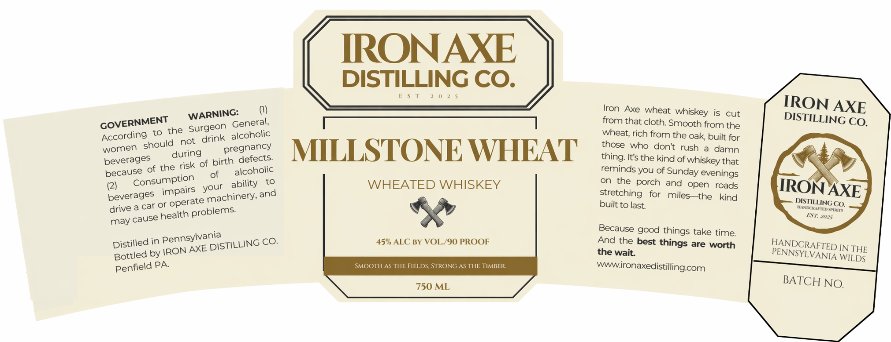

# TTB COLA Label Images - TTBID 26105001000260

**Brand Name:** MILLSTONE WHEAT

**Fanciful Name:** WHEATED WHISKEY

**Issue Date:** 04/21/2026

**Origin Code:** 39

**Product Class/Type:** 140

**Source:** [TTB Public COLA Registry](https://ttbonline.gov/colasonline/viewColaDetails.do?action=publicFormDisplay&ttbid=26105001000260)

## Label Images

### Label 1

## Extracted Label Text

*Text extracted via OCR - may contain errors*

**Detected Proof:** 90

### Label 1

IRONAXE
DISTILLING CO.
Iron
wheat
is
cut
IRON AXE
General,
that cloth: Smooth
the
DISTILLING CO.
According
to the
Gurgeon
wheat; rich from the oak built for
during
MILLSTONE WHEAT
those
who dont
rush
damn
beverages
of birth defects
Its the kind of
that
because of the risk
reminds you of
of
(2)
your
ability
to
WHEATED WHISKEY
on
the
porch
and
open
roads
IRONAXE
beverages
machinery;
for
miles
the
kind
drive a car or
built to last
DISTILLINGCQ:
health
EST: 2025
may
Because good
take time
Distilled in
CO_
45% ALC BY VOL/90 PROOF
And the best
are worth
HANDCRAFTED
by
AXE
the wait
PENNSYLWANIR WIDE
WILDS
PA
SMOOTH AS THE FIELDS; STRONG AS THE TIMBER
wironaxedistillingcom
750 ML
BATCH NO,
Axe
whiskey
WARNING:
GOVERNMENT
from
from
alcoholic
not
should
pregnancy
women
thing:
whiskey
alcoholic
Sunday
evenings
Consumption
impairs
and
stretching
operate
problems:
cause
things
Pennsylvania
things
DISTILLING
IRON
Bottled
Penfield
