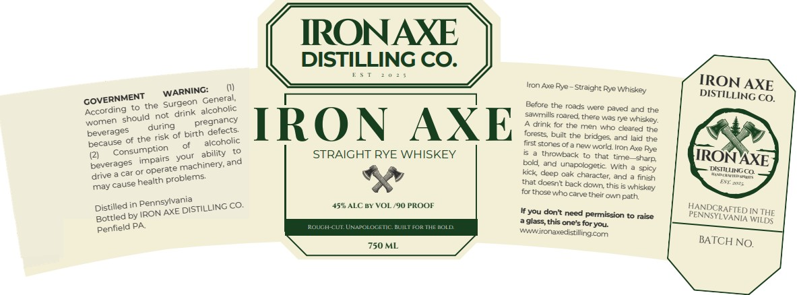

# TTB COLA Label Images - TTBID 26105001000387

**Brand Name:** IRON AXE

**Issue Date:** 04/17/2026

**Origin Code:** 39

**Product Class/Type:** 102

**Source:** [TTB Public COLA Registry](https://ttbonline.gov/colasonline/viewColaDetails.do?action=publicFormDisplay&ttbid=26105001000387)

## Label Images

### Label 1

## Extracted Label Text

*Text extracted via OCR - may contain errors*

**Detected Proof:** 90

### Label 1

IRONAXE
DISTILLING CO.
Iron Axe Rye - Straight Rye Whiskey
IRON AXE
WAREINGeneral
DISTILLING CO.
According
to the
Surgeon
Before the roads were paved and the
should
drink
sawmills rcared; there was rye
bevecages
during
defects:
IRON
AXE
drink for the men who cleared the
of the risk of birth
built the bridges; ad laid the
first stones of a new worla Iron Axe Rye
ability
STRAIGHT RYE WHISKEY
throwback to
that time
shaip;
beverages
machinery, and
bold,
and unapologetic With
drive
car Or
kick deep oak character; and
spicy
DSTINGCo
finish
may
that dcesnt back down this is whiskey
for those who carve their own path;
Distilled in
CO_
45"ALC BY VOL
90 PROOF
HANDCRAFTED E
by IRON AXE
#you dont need permission to raise
IN THE
Bottled
PA
Rouch CcutUnapOiotetc ruitror Thetold
glass;this one's for you:
WILDS
wwwironaxedistiingcom
750 ML
BATCH NO.
GOVERNMENT
alcoholic
not
vhikey:
pregnancy
foreste
alcoholic
because
Consumption
IRONAXE
your
impairs
operate
problems
health
KA;
cause
Pennsylvania
DISTILLING =
PENNSYIVANIA
Penfield
