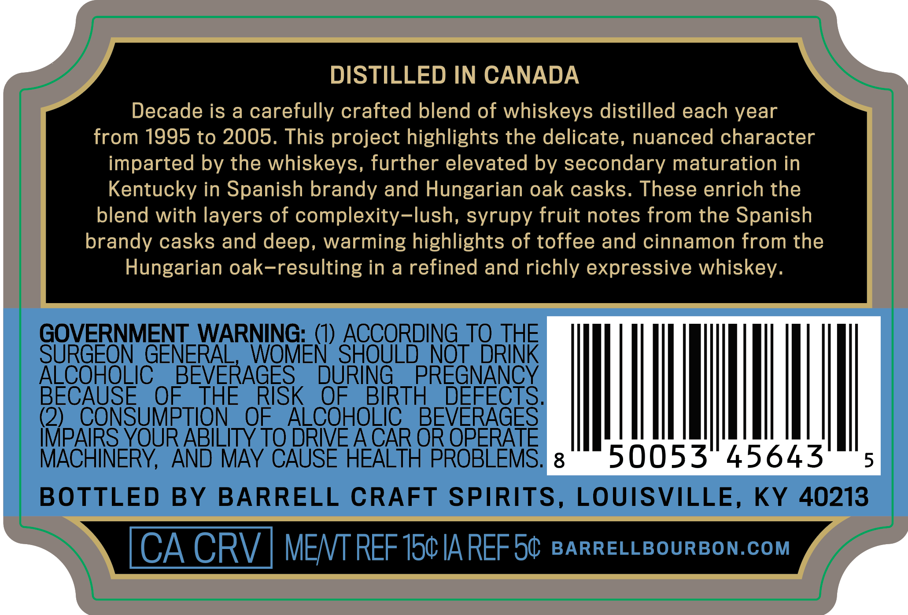
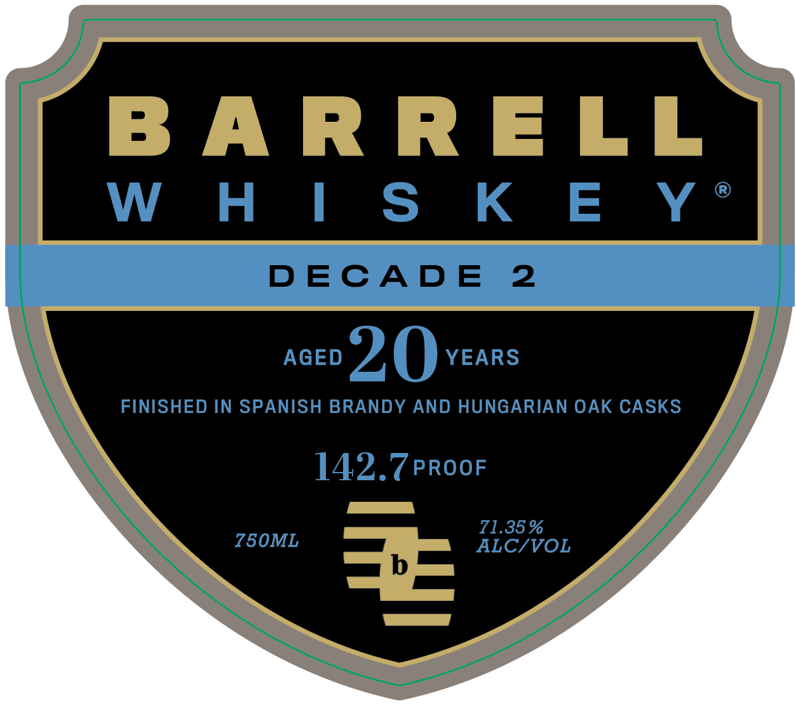
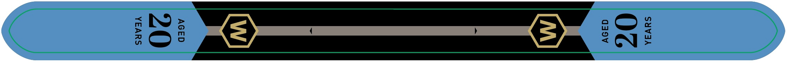

# TTB COLA Label Images - TTBID 26105001000484

**Brand Name:** BARRELL WHISKEY

**Issue Date:** 04/17/2026

**Origin Code:** 22

**Product Class/Type:** 140

**Source:** [TTB Public COLA Registry](https://ttbonline.gov/colasonline/viewColaDetails.do?action=publicFormDisplay&ttbid=26105001000484)

## Label Images

### Back Label

### Front Label

### Label 3

## Extracted Label Text

*Text extracted via OCR - may contain errors*

*1 image(s) excluded: text did not meet readability threshold*

**Detected Proof:** 142.7
**Detected Age:** 20 Years

### Back Label

DISTILLED IN CANADA
Decade is a carefully crafted blend of whiskeys distilled each year
from 1995 to 2005. This project highlights the delicate, nuanced character
imparted by the whiskeys, further elevated by secondary maturation in
Kentucky in Spanish brandy and Hungarian oak casks. These enrich the
blend with layers of complexity-lush, syrupy fruit notes from the Spanish
brandy casks and deep, warming highlights of toffee and cinnamon from the
Hungarian oak-resulting in a refined and richly expressive whiskey.
GOVERNMENT_WARNING:_(I) ACCORDING_TQ THE
SURGEON GENERAL
WOMEN SHOULD NOT DRINK
ALCOHOLIC
BEVERAGES
DURING
PREGNANCY
BECAUSE
OF
THE
RISK
OF
BIRTH
DEFECTS.
(2)
CONSUMPTION
OF
ALCOHOLIC
BEVERAGES
IMPAIRS_YOUR ABILITY TO DRIE ACAR OR OPERATE
MACHINERY,
AND MAY CAUSE HEALTH PROBLEMS.
8
50053
45643
5
BOTTLED
BY
BARRELL CRAFT SPIRITS,
LOUISVILLE,
KY
40213
CA CRV
MENT REF 150IA REF54
BARRELLBOURBON.COM

### Front Label

B AR R ELL
W H | S K E Y
DECAD E
2
AGED
20
YEARS
FINISHED IN SPANISH BRANDY AND HUNGARIAN OAK CASKS
142.7PROOF
71.35 %
750ML
ALC/VOL
3=
