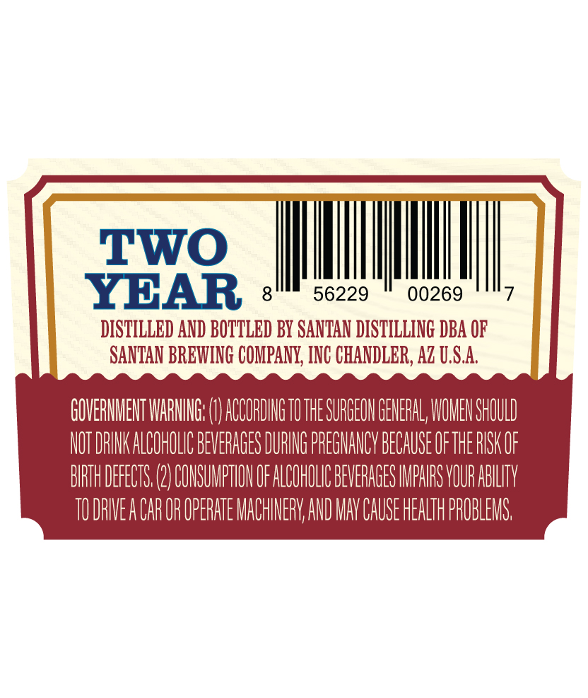
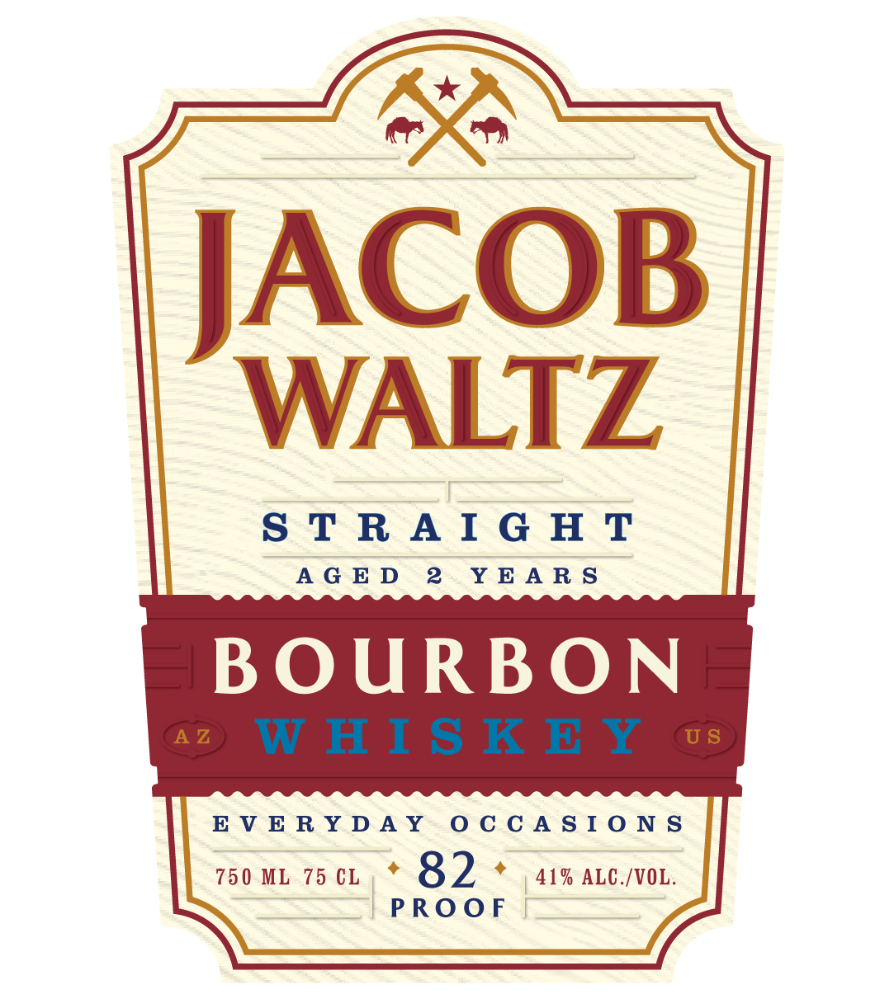

# TTB COLA Label Images - TTBID 26105001000553

**Brand Name:** JACOB WALTZ

**Fanciful Name:** STRAIGHT BOURBON WHISKEY AGED 2 YEARS

**Issue Date:** 04/23/2026

**Origin Code:** 11

**Product Class/Type:** 101

**Source:** [TTB Public COLA Registry](https://ttbonline.gov/colasonline/viewColaDetails.do?action=publicFormDisplay&ttbid=26105001000553)

## Label Images

### Back Label

### Front Label

## Extracted Label Text

*Text extracted via OCR - may contain errors*

**Detected Proof:** 82
**Detected Age:** 2 Years

### Back Label

TWO
YBAR
8
56229
00269
DISTILLED AND BOTTLED BY SANTAN DISTILLING DBA OF
SANTAN BREWING COMPANY, INC CHANDLER, Az U,S.A
GOVERMMEHT WARIG: (
ACCORDIG TOTHE SURGEOH GENERAL; WOMEN SHOULD
NOT DRINK ALCOHOLIC BEVERAGES DURING PREGMANCV BECAUSE OFTHE RISK OF
BIRTH DEFECTS (2) COMSUMPTHOH OF ALCOHOLIC BEVERAGES IMPHRS VOUR ABLLTV
TU DRIVEA CAR OR OPERATE MACHINERV AND MAV CAUSE HEALTH PROBLEMS

### Front Label

oO

ACOB

WALTZ

=

STRAIGHT

AGED 2 YEARS

BOURBON

EVERYDAY OCCASIONS

750ML 75cL,* OD * 41% ALC./VOL.

| PROOF
