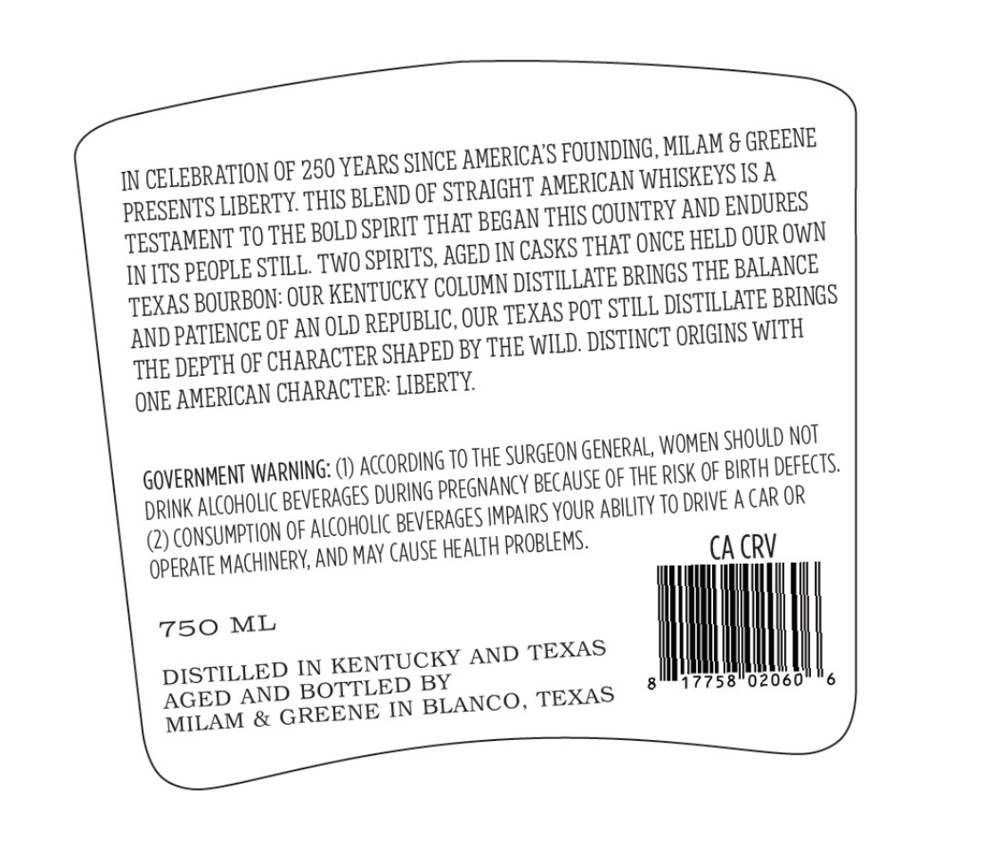
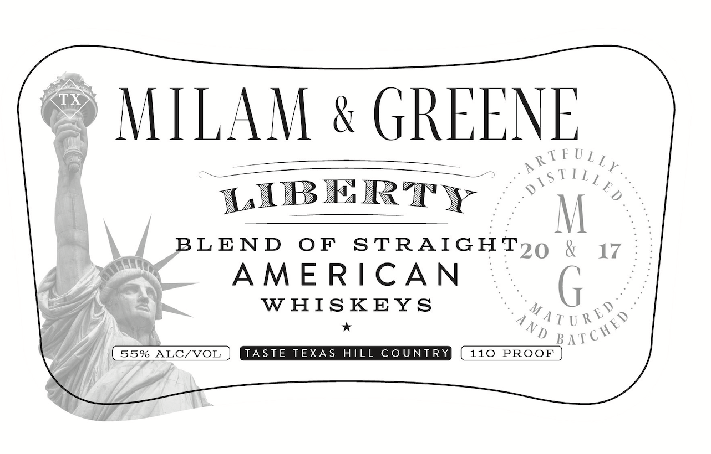

# TTB COLA Label Images - TTBID 26105001000561

**Brand Name:** MILAM & GREENE LIBERTY

**Issue Date:** 04/22/2026

**Origin Code:** 44

**Product Class/Type:** 129

**Source:** [TTB Public COLA Registry](https://ttbonline.gov/colasonline/viewColaDetails.do?action=publicFormDisplay&ttbid=26105001000561)

## Label Images

### Back Label

### Front Label

## Extracted Label Text

*Text extracted via OCR - may contain errors*

### Back Label

IN CELEBRATION OF 250 YEARS SINCE AMERICA'S FOUNDING, MILAM & GREENE
PRESENTS LIBERTY. THIS BLEND OF STRAIGHT AMERICAN WHISKEYS IS A
TESTAMENT TO THE BOLD SPIRIT THAT BEGAN THIS COUNTRY AND ENDURES
INITS PEOPLE STILL. TWO SPIRITS, AGED IN CASKS THAT ONCE HELD OUROWN
TEXAS BOURBON: OUR KENTUCKY COLUMN DISTILLATE BRINGS THE BALANCE
AND PATIENCE OF ANOLD REPUBLIC, OUR TEXAS POT STILL DISTILLATE BRINGS
THE DEPTH OF CHARACTER SHAPED BY THE WILD. DISTINCT ORIGINS WITH
ONE AMERICAN CHARACTER: LIBERTY.
GOVERNMENT WARNING: (1) ACCORDING 10 THE SURGEON GENERAL, WOMEN SHOULD NOT
DRINK ALCOHOLIC BEVERAGES DURING PREGNANCY BECAUSE OF THE RISK OF BIRTH DEFECTS.
(2) CONSUMPTION OF ALCOHOLIC BEVERAGES |MPAIRS YOUR ABILITY 10 DRIVE ACAR OR
OPERATE MACHINERY, AND MAY CAUSE HEALTH PROBLEMS.

CACRV
oer Wh
DISTILLED IN KENTUCKY AND TEXAS
‘AGED AND BOTTLED BY
MILAM & GREENE IN BLANCO, TEXAS gm 1775802060" 6

### Front Label

MILAM & GREENE
eee ere gtk UL,
= TIL, ?
LIBERTY - > iV ne
BLEND OF STRAIGHT 9,9 { 17
AMERICAN fi
WHISKEYS ys
