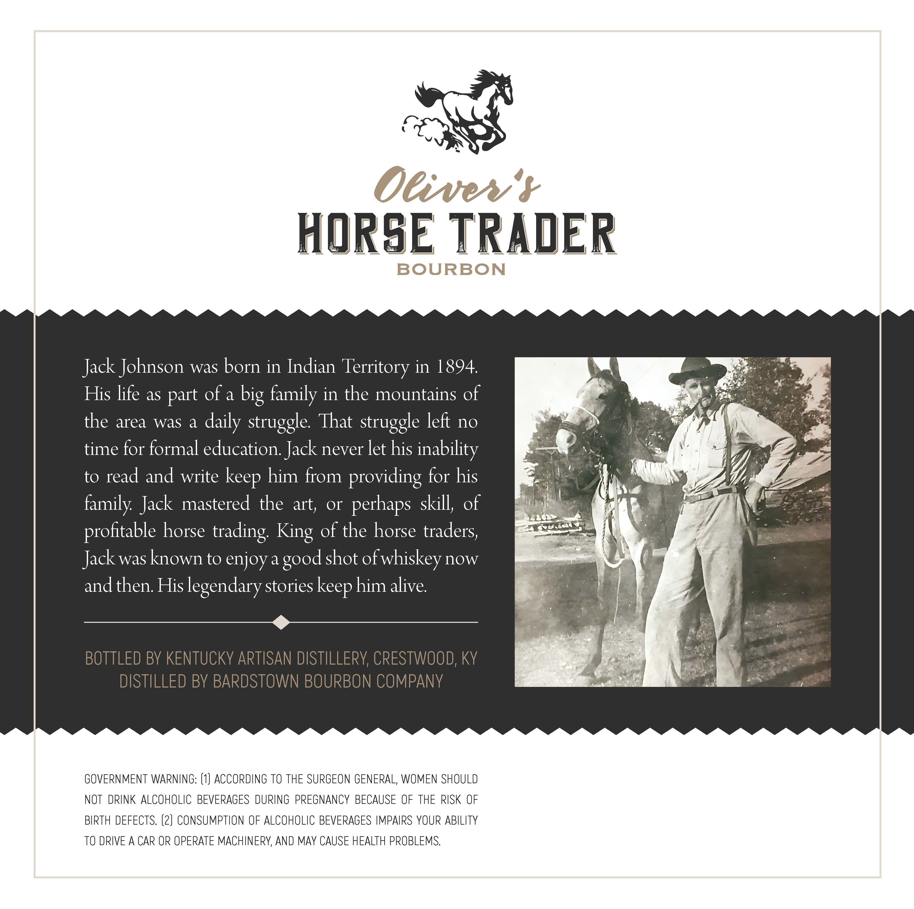
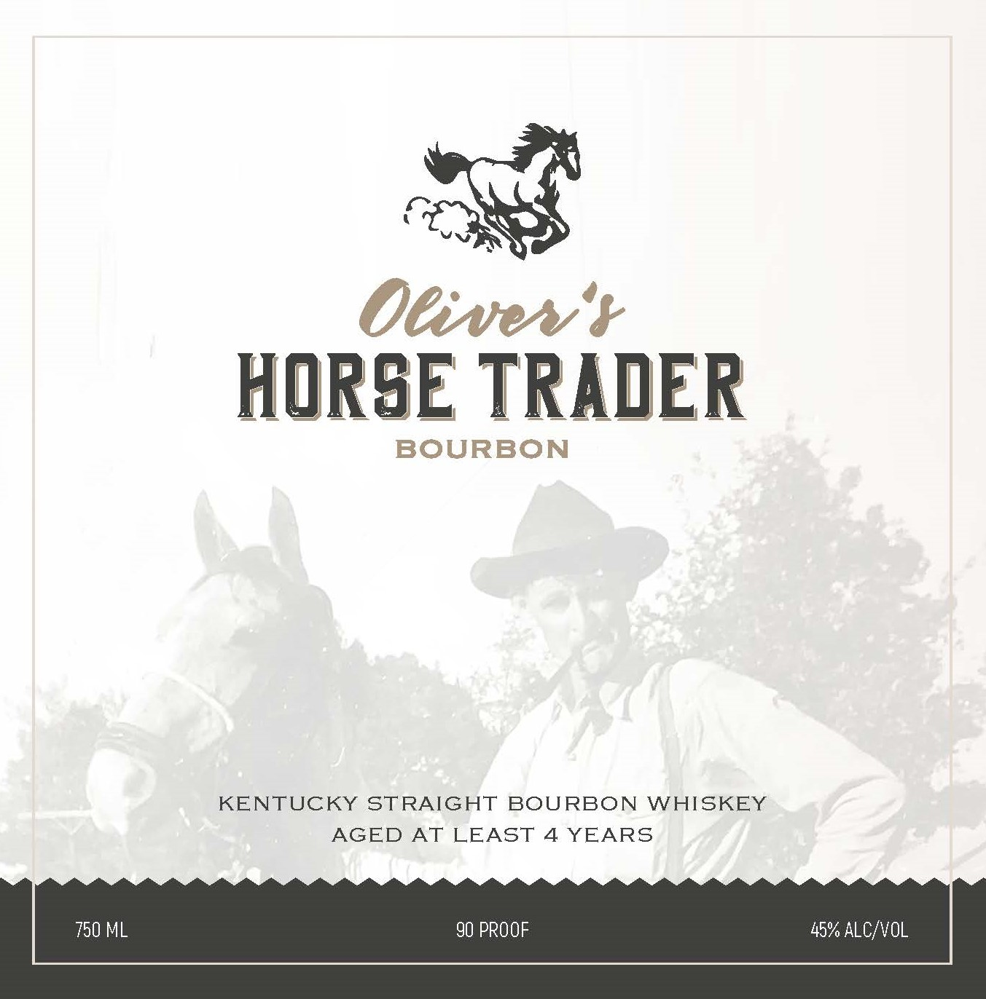

# TTB COLA Label Images - TTBID 26105001000563

**Brand Name:** OLIVER'S HORSE TRADER

**Issue Date:** 04/24/2026

**Origin Code:** 22

**Product Class/Type:** 101

**Source:** [TTB Public COLA Registry](https://ttbonline.gov/colasonline/viewColaDetails.do?action=publicFormDisplay&ttbid=26105001000563)

## Label Images

### Back Label

### Front Label

## Extracted Label Text

*Text extracted via OCR - may contain errors*

**Detected Proof:** 90
**Detected Age:** 4 Years

### Back Label

DeivevY
HORSE TRADER
BOURBON
Jack Johnson was born in Indian Territory in 1894
His life as
of a
family in the mountains of
the area
was
a
daily struggle That struggle left no
time for formal education Jack never let his
inability
to read and write
him from providing for his
family Jack mastered the at
or
perhaps skill; of
proftable horse
of the horse traders;
Jackwasknown to enjoy a
shot
ofwhiskey =
now
andthen Hislegendary stories
him alive
BOTTLED BY KENTUCKY ARTISAN DISTILLERY CRESTWOOD, KY
DISTILLED BY BARDSTOWN BOURBON COMPANY
GOVERNMENT WARNING: (1) ACCORDING To THE SURGEON GENERAL, WOMEN SHOULD
NOT  DRINK ALCOHOLIC BEVERAGES DURING PREGNANCY BECAUSE OF THE RISK OF
BIRTH DEFECTS. (2) CONSUMPTION OF ALCOHOLIC BEVERAGES IMPAIRS YOUR ABILITY
TO DRIVE A CAR OR OPERATE MACHINERV, AND MAY CAUSE HEALTH PROBLEMS
big
part
keep
trading:
King
good
keep

### Front Label

ia
Oliver't
HORSE TRADER

BOURBON

KENTUCKY STRAIGHT BOURBON WHISKEY
AGED AT LEAST 4 YEARS

90 PROOF

45% ALC/VOL
