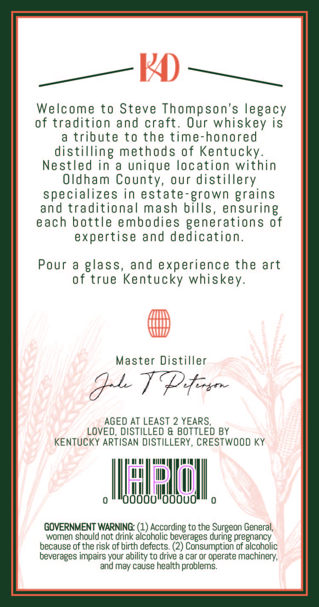
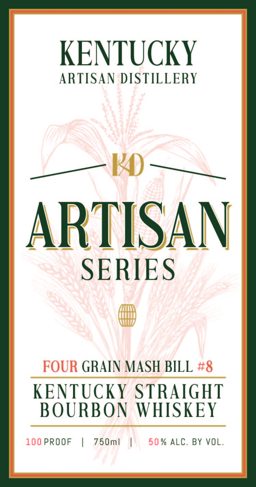

# TTB COLA Label Images - TTBID 26105001000595

**Brand Name:** ARTISAN SERIES

**Fanciful Name:** FOUR GRAIN

**Issue Date:** 04/20/2026

**Origin Code:** 22

**Product Class/Type:** 101

**Source:** [TTB Public COLA Registry](https://ttbonline.gov/colasonline/viewColaDetails.do?action=publicFormDisplay&ttbid=26105001000595)

## Label Images

### Back Label

### Front Label

### Label 4

## Extracted Label Text

*Text extracted via OCR - may contain errors*

*1 image(s) excluded: text did not meet readability threshold*

**Detected Proof:** 100
**Detected Age:** 2 Years

### Back Label

K
Welcome to Steve Thompson's legacy
of tradition and craft.
Our whiskey is
a
tribute to the time-honored
distilling methods of Kentucky
Ne stled in
a
unique location within
Oldham County, our distillery.
specializes in estate-grown grains
and traditional mash bills
ensuring
each bottle embodies generations 0f
expertise and dedication.
Pour & glass, and experience the art
of true Kentucky whiskey.
Master Distiller
}1 TPtr
AGED AT LEAST 2 YEARS,
LOVED, DISTILLED & BOTTLED BY
KENTUCKY ARTISAN DISTILLERY, CRESTWOOD KY
dooou"Ooouo
GOVERNMENT WARNING: (1) According to the Surgeon General;
women should not drink alcoholic beverages during pregnancy;
because of the risk of birth defects: (2) Consumption of alcoholic
beverages impairs your ability to drive a car or operate machinery,
and may cause health problems.

### Front Label

KENTUCKY

ARTISAN DISTILLERY

ARTISAN

SERIES

LTT

(TM

WW

FOUR GRAIN MASH BILL #8

KENTUCKY STRAIGHT

BOURBON WHISKEY

100PROOF | 750m! | 650% ALC. BY VOL.
