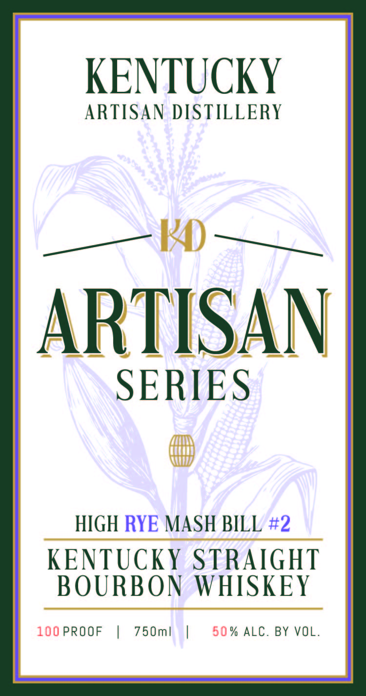
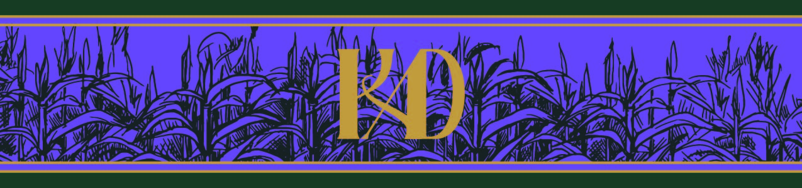

# TTB COLA Label Images - TTBID 26105001000603

**Brand Name:** ARTISAN SERIES

**Fanciful Name:** HIGH RYE

**Issue Date:** 04/20/2026

**Origin Code:** 22

**Product Class/Type:** 101

**Source:** [TTB Public COLA Registry](https://ttbonline.gov/colasonline/viewColaDetails.do?action=publicFormDisplay&ttbid=26105001000603)

## Label Images

### Back Label

### Front Label

### Label 3

## Extracted Label Text

*Text extracted via OCR - may contain errors*

*1 image(s) excluded: text did not meet readability threshold*

**Detected Proof:** 100

### Back Label

Barrel #
Single Barrel
2 _ 0o36
BARRELS TO BOTTLES PROGRAM
Text
Kere
SELECTED AT KENTUCKY ARTISAN DISTILLERY
oOC

### Front Label

KENTUCKY
ARTISAN DISTILLERY
KO
ARTISAN
SERIES
HIGH RYE MASH BILL #2
KENTUCKY STRAIGHT
BOURBON WHISKEY
100 PROOF
75 Oml
5 0 % ALC. BY VOL.
