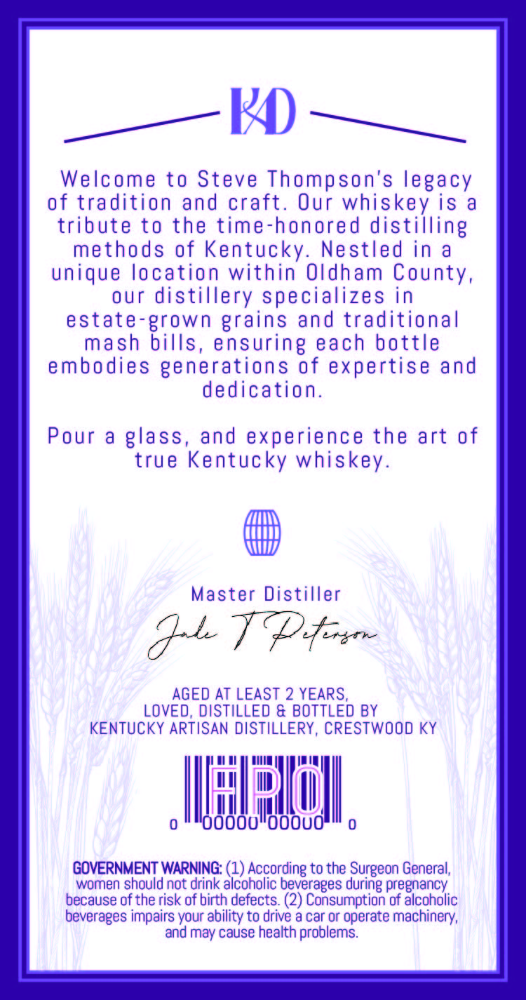
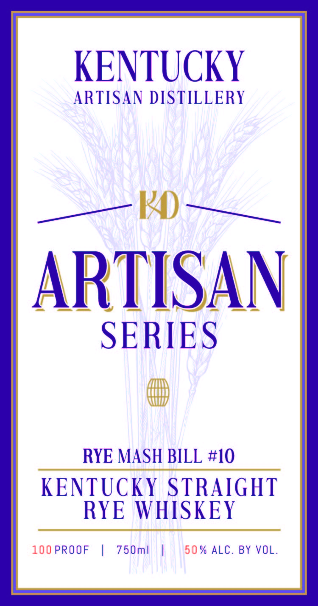

# TTB COLA Label Images - TTBID 26105001000609

**Brand Name:** ARTISAN SERIES

**Issue Date:** 04/20/2026

**Origin Code:** 22

**Product Class/Type:** 102

**Source:** [TTB Public COLA Registry](https://ttbonline.gov/colasonline/viewColaDetails.do?action=publicFormDisplay&ttbid=26105001000609)

## Label Images

### Back Label

### Front Label

### Label 4

## Extracted Label Text

*Text extracted via OCR - may contain errors*

*1 image(s) excluded: text did not meet readability threshold*

**Detected Proof:** 100
**Detected Age:** 2 Years

### Back Label

Welcome to Steve Thompson's legacy
of tradition and craft. Our whiskey is a
tribute to the time-honored distilling
methods of Kentucky. Nestled in a
unique location within Oldham County,
our distillery specializes in
estate-grown grains and traditional
mash bills, ensuring each bottle
embodies generations of expertise and
dedication.
Pour a glass, and experience the art of
true Kentucky whiskey.
Master Distiller
F
pote Cngthe
AGED AT LEAST 2 YEARS,
LOVED, DISTILLED & BOTTLED BY
KENTUCKY ARTISAN DISTILLERY, CRESTWOOD KY
i a gy at UT
fila
WAL gah
0 d000"000U i)

GOVERNMENT WARNING: (1) According to the Surgeon General,
women should not drink alcoholic beverages during pregnancy
because of the risk of birth defects. (2) Consumption of alcoholic
beverages impairs your ability to drive a car or operate machinery,
and may cause health problems.

### Front Label

KENTUCKY
ARTISAN DISTILLERY
KA
ARTISAN
SERIES
RYE MASH BILL #I0
KENTUCKY STRAIGHT
RYE WHISKEY
100 PROOF
1
75 Oml
5 0 % ALC. BY VOL.
