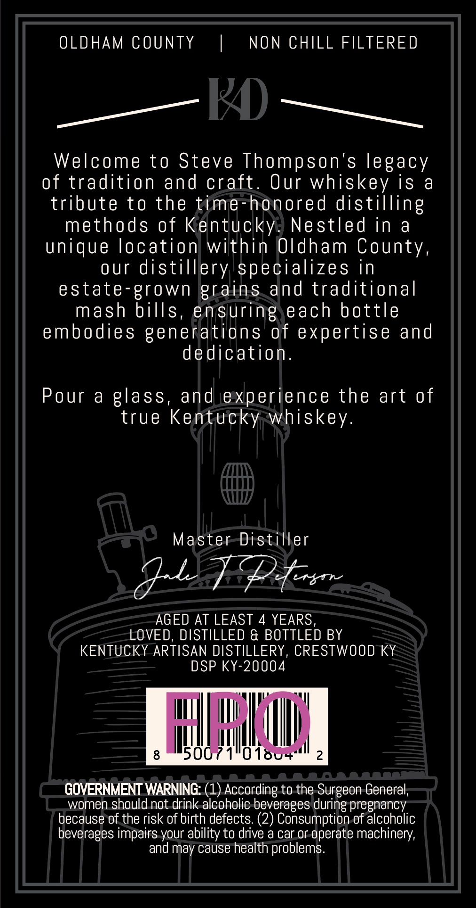
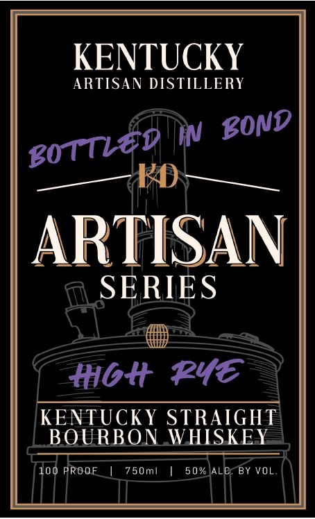

# TTB COLA Label Images - TTBID 26105001000623

**Brand Name:** ARTISAN SERIES

**Issue Date:** 04/21/2026

**Origin Code:** 22

**Product Class/Type:** 119

**Source:** [TTB Public COLA Registry](https://ttbonline.gov/colasonline/viewColaDetails.do?action=publicFormDisplay&ttbid=26105001000623)

## Label Images

### Back Label

### Front Label

### Label 3

## Extracted Label Text

*Text extracted via OCR - may contain errors*

*1 image(s) excluded: text did not meet readability threshold*

**Detected Proof:** 100
**Detected Age:** 4 Years

### Back Label

OLDHAM COUNTY
NON CHILL FILTERED
~K
Welcome to Steve Thompson's legacy
of tradition and craft
Our whiskey is
a
tribute t0 the time-honored distilling
methods of Kentucky:
Nestled in
a
unique location within Oldham County,
our
distillery specializes in
estate-grown grains and traditional
mash bills, ensuring each bottle
embodies generations @f expertise ad
dedication_
Pour &
glass, and experience the art of
true Kentucky whiskey.
Master Distiller
Ae+
AGED AT LEAST
4
YEARS
LOVED, DISTILLED & BOTTLED BY
KENTUCKY ARTISAN DISTILLERY, CRESTWOOD KY
DSP KY-20004
8
Wb
16u
2
GOVERNMENT WARNING: (1) According to the Surgeon General;
women should not drink alcoholic beverages
pregnancy
because of the risk of birth defects: (2) Consumption of alcoholic
beverages impairs your ability to drive a car or operate machinery,
and may cause health problems:
during

### Front Label

KENTUCKY
ARTISAN DISTILLERY
W
ARTISAN
SERIES
#bt Pye
KENTUCKY STRAIGHT
BOURBON WHISKEY
100 PROOF
750ml
5 0 %
BY VOL
EOND
Bottled
