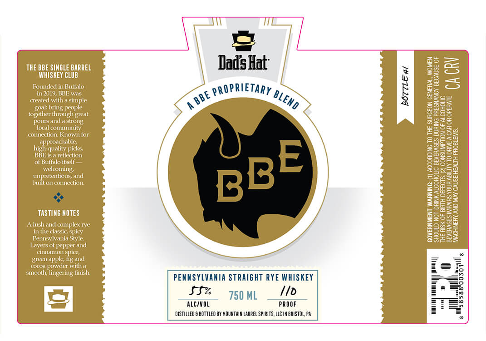

# TTB COLA Label Images - TTBID 26105001000694

**Brand Name:** DAD'S HAT

**Issue Date:** 04/17/2026

**Origin Code:** 39

**Product Class/Type:** 102

**Source:** [TTB Public COLA Registry](https://ttbonline.gov/colasonline/viewColaDetails.do?action=publicFormDisplay&ttbid=26105001000694)

## Label Images

### Label 1

## Extracted Label Text

*Text extracted via OCR - may contain errors*

### Label 1

THE BBE SINGLE BARREL
WHISKEY CLUB

Founded in Butfalo
in 2019, BBE was
created with a simple
‘goal bring people
together through great

poursand a
local community
connection. Known for
approachable,
high-quality picks,
BBE isa rellection
‘of Buifalo itself —
welcoming,
unpreteni
built on connection.

TASTING NOTES

Alushand
in the classic, sp
Pennsylva

Layers of pepper and.
cinnamon spice,
green apple, fig and
cocoa powder witha
smooth, lingering fin

PENNSYLVANIA STRAIGHT RYE WHISKEY
5% som, _ fo

ALC/VOL PROOF
DISTILLED 6 BOTTLED BY MOUNTAIN LAUREL SPIRITS, LLC IN BRISTOL, PA

‘ACCORDING TO THE SURGEON GENERAL. WOMEN
‘BEVERAGES DURING PREGNANCY BECAUSE OF

CACRY

CONSUMPTION OF ALCOHOLIC

THE RISK OF BIRTH DEFECTS.
BEVERAGES IMPAIRS YOUR ABILITY TO DRIVE A CAR OR OPERATE.
MACHINERY, AND MAY CAUSE HEALTH PROBLEMS.
