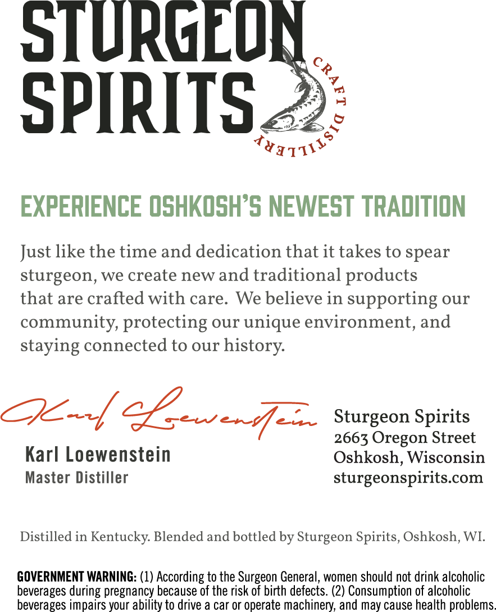
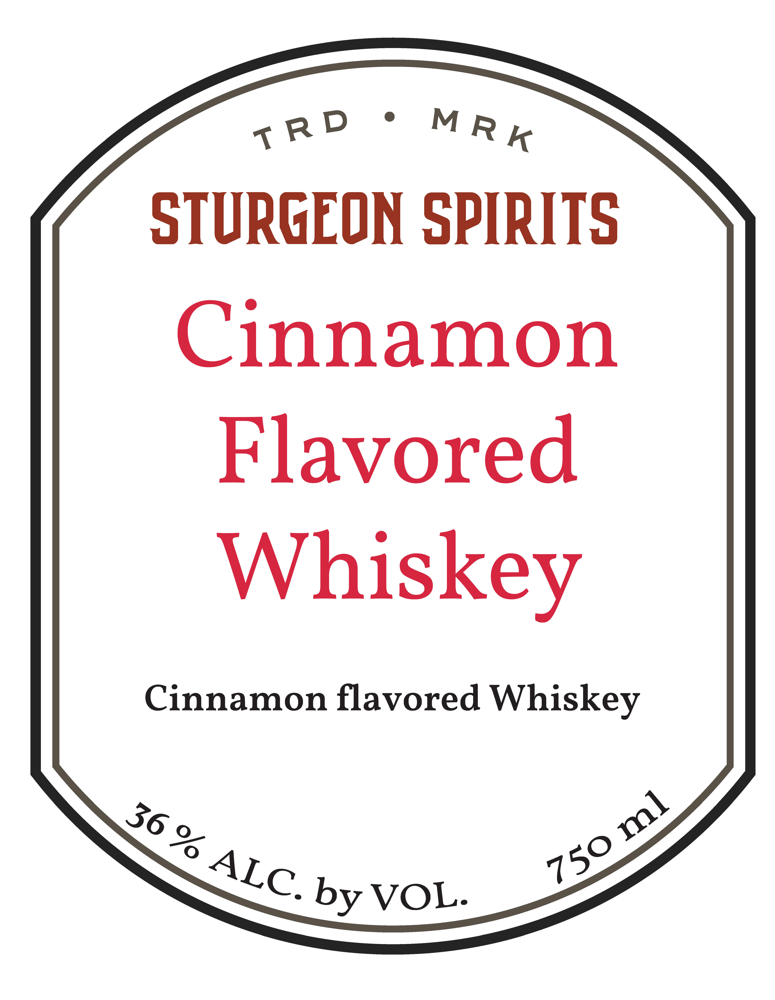

# TTB COLA Label Images - TTBID 26105001000712

**Brand Name:** STURGEON SPIRITS

**Issue Date:** 04/17/2026

**Origin Code:** 48

**Product Class/Type:** 149

**Source:** [TTB Public COLA Registry](https://ttbonline.gov/colasonline/viewColaDetails.do?action=publicFormDisplay&ttbid=26105001000712)

## Label Images

### Back Label

### Front Label

## Extracted Label Text

*Text extracted via OCR - may contain errors*

### Back Label

STURGEUN
SPIRITS
7
6
TY1TI1`
EXPERIENCE OSHKOSHPS NEWEST TRADITION
Just like the time and dedication that it takes to spear
sturgeon, we create new and traditional
products
that are crafted with care.
We believe in supporting our
community, protecting our unique environment, and
staying connected to our history:
22-d[ e_+72
Sturgeon Spirits
2663 Oregon Street
Karl Loewenstein
Oshkosh, Wisconsin
Master Distiller
sturgeonspirits com
Distilled in Kentucky Blended and bottled by Sturgeon Spirits, Oshkosh, WI
GOVERNMENT WARNING: (1) According to the Surgeon General, women should not drink alcoholic
beverages
pregnancy because of the risk of birth defects. (2) Consumption of alcoholic
beverages impairs your abiiity to drive a car or operate machinery,
may cause health problems
8
2
during
and

### Front Label

tRP * MRE
STURGEON SPIRITS
Cinnamon
Flavored
Whiskey
Cinnamon flavored Whiskey
Nie by VOL. ,
