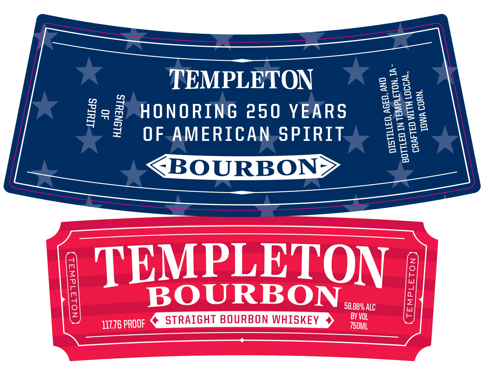
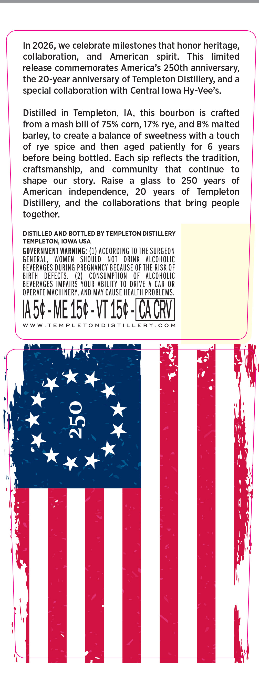

# TTB COLA Label Images - TTBID 26105001000787

**Brand Name:** TEMPLETON

**Issue Date:** 04/17/2026

**Origin Code:** 20

**Product Class/Type:** 101

**Source:** [TTB Public COLA Registry](https://ttbonline.gov/colasonline/viewColaDetails.do?action=publicFormDisplay&ttbid=26105001000787)

## Label Images

### Label 1

### Label 2

## Extracted Label Text

*Text extracted via OCR - may contain errors*

**Detected Age:** 6 Years

### Label 1

TEMPLETON

HONORING 250 YEARS
OF.AMERICAN.-SPIRIT

JOWA CORN.

LUuTds
40
T

HLONIUIS

B O URB ON eee

¢ STRAIGHT BOURBON WHISKEY 4 irae ST ALCHT SOUREON WHISKEY

TEMPLETON

11776 PROOF

### Label 2

In 2026, we celebrate milestones that honor heritage,
collaboration, and American spirit. This limited
release commemorates America’s 250th anniversary,
the 20-year anniversary of Templeton Distillery, and a
special collaboration with Central lowa Hy-Vee’s.

Distilled in Templeton, IA, this bourbon is crafted
from a mash bill of 75% corn, 17% rye, and 8% malted
barley, to create a balance of sweetness with a touch
of rye spice and then aged patiently for 6 years
before being bottled. Each sip reflects the tradition,
craftsmanship, and community that continue to
shape our story. Raise a glass to 250 years of
American independence, 20 years of Templeton
Distillery, and the collaborations that bring people
together.

DISTILLED AND BOTTLED BY TEMPLETON DISTILLERY
TEMPLETON, IOWA USA

GOVERNMENT WARNING: (1) ACCORDING T0 THE SURGEON
GENERAL, WOMEN SHOULD NOT DRINK ALCOHOLIC
BEVERAGES DURING PREGNANCY BECAUSE OF THE RISK OF
BIRTH DEFECTS. (2) CONSUMPTION OF ALCOHOLIC
BEVERAGES IMPAIRS YOUR ABILITY TO DRIVE A CAR OR
OPERATE MACHINERY, AND MAY CAUSE HEALTH PROBLEMS.

6 -ME 15¢ -\T-15¢ -(CA CRY

WWW.TEMPLETONDISTILLERY.COM
