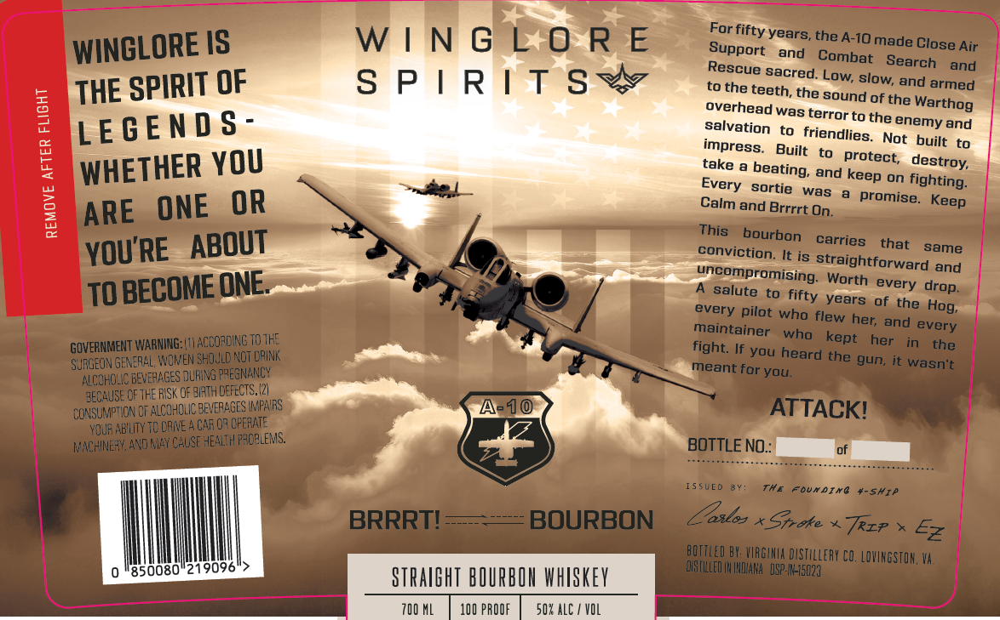

# TTB COLA Label Images - TTBID 26105001000913

**Brand Name:** WINGLORE SPIRITS

**Fanciful Name:** BRRRT! BOURBON

**Issue Date:** 04/16/2026

**Origin Code:** 05

**Product Class/Type:** 101

**Source:** [TTB Public COLA Registry](https://ttbonline.gov/colasonline/viewColaDetails.do?action=publicFormDisplay&ttbid=26105001000913)

## Label Images

### Label 1

## Extracted Label Text

*Text extracted via OCR - may contain errors*

**Detected Proof:** 100

### Label 1

IS
W | N G LO R E
Surfifty years the A-1Omade Close -
WINCLORE
and
Combat   Search
Air
and
sacred.
SPIRIT OF
S P | R | T S `
to the teeth; the
slow; and armed
sound of the
overhead was terror to
LEGEN D $ -
salvation
friendlies.
and
impress
Built
built
6
WHETHER YOU
take &
protect;
and
on
fighting:
sortie
was
promise_
1
ARE
OR
Calm and Brrrrt On.
This
bourbon
YOU RE
ABOUT
conviction  It/is Gtraies
that
same
uncompromising s trorthtforward and
TO BECOME ONE
salute
"isiny Worth every
years
of the Hog;
pilot who flew
maintainer
and
GOVERNMENT WARNING:  4ACCO DING TOTh"
fight. If
who
kept
her
Surgeon GenERAL Women Sho !ld NOT DRnNk
you
gun, it wasn't
' BEvehAGES DuriNG PPEznAnCY
meant for you.
ALCZHO_IC
BEGAUSE QeThe RISK OF BAT4 DEFECTS.@1
Consumpton Of ALCOHOUC beverages eNas
A-1o
ATTACKI
YOUr ABLTY TC DRNE
CAT 0? OFERATE
WACHUNEFY,AVO May CAuSe HEalth problenS:
BOTTLE NO:
S YE C
TE
FourDIXQ
#-SKIA
BRRRTI
BOURBON
Zasloz
Stroke
Trz?
Ez
BOTTLED BY VIAGIHLA DISTILLERY CO. LVIGSTOK; Va
850080"219096
DITLLED M IHMARA^ OSP-+i5023
StraIehT BIURBOU whSkeY
700 ML
100 PROOF
50X ALC / VOL
Support
Rescue
Low;
THE
1
Warthog
the
enemy
Not
destroy;
beating;
keep
Every
ONE
Keep
drop.
every
her;
every
the
heard
the
