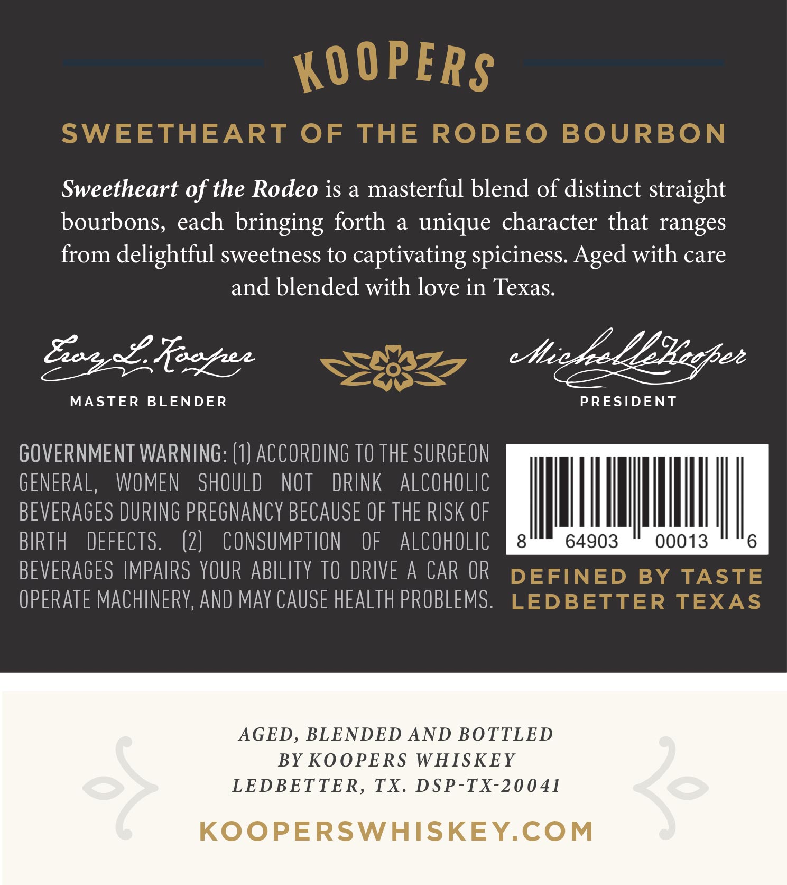
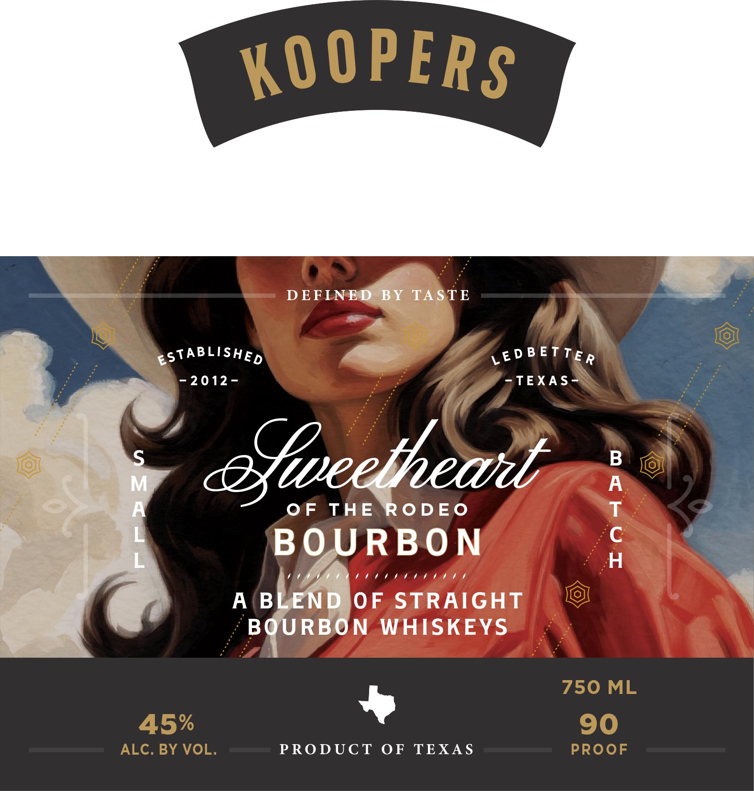

# TTB COLA Label Images - TTBID 26106001000175

**Brand Name:** KOOPERS

**Fanciful Name:** SWEETHEART OF THE RODEO BOURBON

**Issue Date:** 04/17/2026

**Origin Code:** 44

**Product Class/Type:** 121

**Source:** [TTB Public COLA Registry](https://ttbonline.gov/colasonline/viewColaDetails.do?action=publicFormDisplay&ttbid=26106001000175)

## Label Images

### Back Label

### Front Label

## Extracted Label Text

*Text extracted via OCR - may contain errors*

### Back Label

KOOPERS
SWEETHEART OF
THE
RODEO
BOURBON
Sweetheart of the Rodeo is a masterful blend of distinct straight
bourbons, each bringing forth
a
unique character that ranges
from delightful sweetness to captivating spiciness Aged with care
and blended with love in Texas.
8982 Reezea
etic/e LExeezee
MASTER
BLENDER
PRESIDENT
GOVERNMENT WARNING: (1) ACCORDING TO THE SURGEON
GENERAL,
WOMEN
SHOULD
NOT
DRINK
alcoholic
BEVERAGES DURING PREGNANCy BECAUSE OF THE RISK OF
BIRTH
DEFECTS.
(2)
COnSumPTION
OF
alCohOLic
8
64903
00013
6
BEVERAGES IMPAIRS YOUR ABILITY TO DRIVE A CAR OR
DEFINED
BY
TASTE
OPERATE MACHINERY, AND May CAUSE HEAlTh PROBLEMS .
LEDBETTER TEXAS
AGED, BLENDED AND BOTTLED
BY KOOPERS
WHISKEY
LEDBETTER,
TX.
DSP-TX-20041
3e
KOoPERSWHISKEY.COM

### Front Label

—— DEFLNESMBY TASTE

oa

eSTABLISHE, oe LEDBETTE,

“mee

-2012- -~TEXAS-=

0 THE Vie

RBON

CHOTA AAEDEDE

Ah ZENDJOF STRAIGHT
- BOURBON WHISKEYS

»

PRODUCT OF TEXAS

Wee

rTraAa Sw
