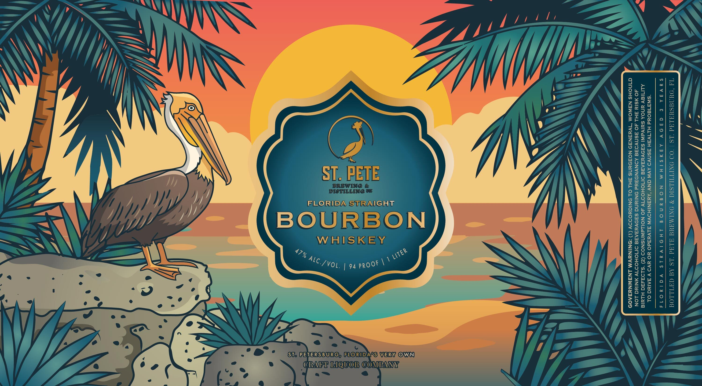

# TTB COLA Label Images - TTBID 26106001000178

**Brand Name:** ST. PETE BREWING & DISTILLING FLORIDA STRAIGHT BOURBON WHISKEY

**Issue Date:** 04/24/2026

**Origin Code:** 16

**Product Class/Type:** 101

**Source:** [TTB Public COLA Registry](https://ttbonline.gov/colasonline/viewColaDetails.do?action=publicFormDisplay&ttbid=26106001000178)

## Label Images

### Label 1

## Extracted Label Text

*Text extracted via OCR - may contain errors*

### Label 1

i)

Td ‘OUNdSuaL

Sra ¥os: 2

‘OO ONITILESIC % ONIMAYE ALdd LS Ad da TLLOd

HD ivals

add LS

qiaov

AAIASIHM NOBANO|D

€ Vd la Or 4

*SWA180¥d HL1VAH ASNVO AVI GNY ‘ANANIHOVW ALVuadO HO YY V JAIN OL
ALIMIGY YNOA SUIVdWI SADVYSAAE SMIOHODT JO NOILdWNSNOD (2) ‘S193430 HUI
do MSIyd FHL AO ASNVDAE AONYNDEYd SNINNG SADVYSASRE OMIOHOOTY ANIC LON
@INOHS NAWOM “1V4aNA9 NOFDeNS AHL OL SNIGHOODOY (1) ‘ONINAVM LNSWNYsA0D

VERY OWN

FLORIDAVSWRAIGHT
WHISK EY
CRADT LIQUOR COMPANY

's

pe

Sie PEVERSDURE, FLORIDA'S
