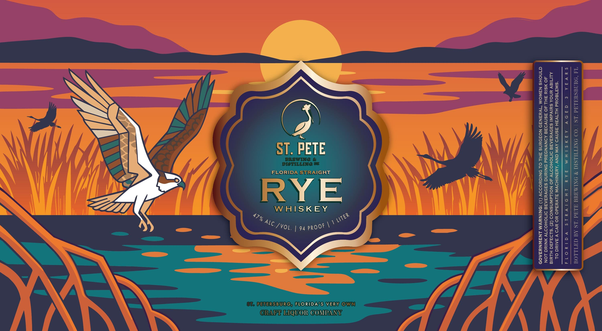

# TTB COLA Label Images - TTBID 26106001000179

**Brand Name:** ST. PETE BREWING & DISTILLING FLORIDA STRAIGHT RYE WHISKEY

**Issue Date:** 04/24/2026

**Origin Code:** 16

**Product Class/Type:** 102

**Source:** [TTB Public COLA Registry](https://ttbonline.gov/colasonline/viewColaDetails.do?action=publicFormDisplay&ttbid=26106001000179)

## Label Images

### Label 1

## Extracted Label Text

*Text extracted via OCR - may contain errors*

### Label 1

ANA WLd “LS AC CATLLOG

Meno iveis vaiyoras
