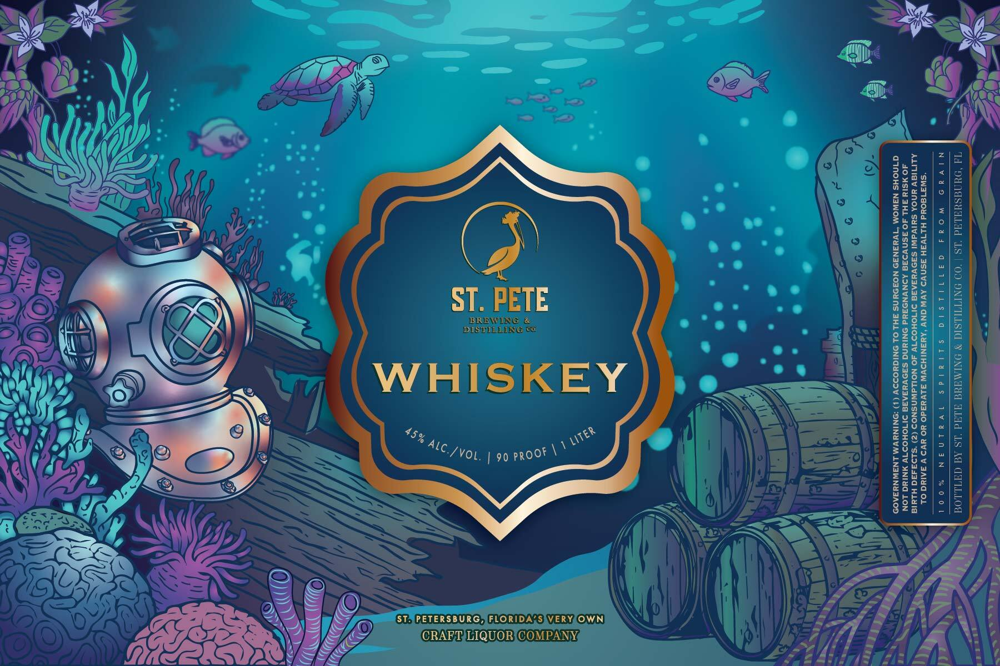

# TTB COLA Label Images - TTBID 26106001000181

**Brand Name:** ST PETE WHISKEY

**Issue Date:** 04/17/2026

**Origin Code:** 16

**Product Class/Type:** 140

**Source:** [TTB Public COLA Registry](https://ttbonline.gov/colasonline/viewColaDetails.do?action=publicFormDisplay&ttbid=26106001000181)

## Label Images

### Label 1

## Extracted Label Text

*Text extracted via OCR - may contain errors*

### Label 1

a SN) }) ZT sk Q = = =
(| i
| i

eT TEE

DIOL LING oo

WHISKEY

%
Al \
C/YvoL | 90 proot \\

BOTTLED BY ST. PETE BREWING & DISTILLING CO. | ST. PETERSBURG, FL

NOT DRINK ALCOHOLIC BEVERAGES DURING PREGNANCY BECAUSE OF THE RISK OF
BIRTH DEFECTS. (2) CONSUMPTION OF ALCOHOLIC BEVERAGES IMPAIRS YOUR ABILITY

GOVERNMENT WARNING: (1) ACCORDING TO THE SURGEON GENERAL, WOMEN SHOULD
TO DRIVE A CAR OR OPERATE MACHINERY, AND MAY CAUSE HEALTH PROBLEMS.

—*
ST) PETERSBURG,JFLORIDA:S)VERY,OWN
CRAETjLIQUOR{COMPANYs
