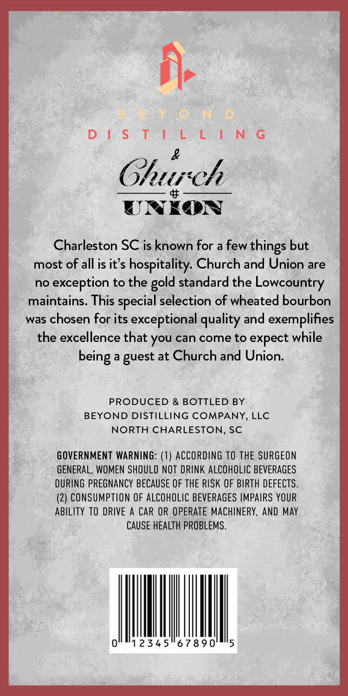
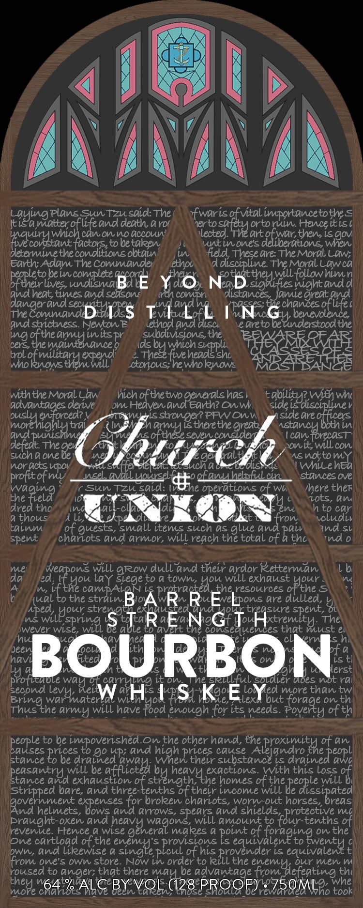

# TTB COLA Label Images - TTBID 26106001000189

**Brand Name:** BEYOND DISTILLING

**Issue Date:** 04/30/2026

**Origin Code:** 41

**Product Class/Type:** 141

**Source:** [TTB Public COLA Registry](https://ttbonline.gov/colasonline/viewColaDetails.do?action=publicFormDisplay&ttbid=26106001000189)

## Label Images

### Back Label

### Front Label

## Extracted Label Text

*Text extracted via OCR - may contain errors*

### Back Label

id

DSS TAS hen GS

&
Church

UNEON

Charleston SC is known for a few things but
most of all is it’s hospitality. Church and Union are
no exception to the gold standard the Lowcountry

maintains. This special selection of wheated bourbon
was chosen for its exceptional quality and exemplifies
the excellence that you can come to expect while
being a guest at Church and Union.

PRODUCED & BOTTLED BY
BEYOND DISTILLING COMPANY, LLC
NORTH CHARLESTON, SC

GOVERNMENT WARNING: (1) ACCORDING 10 THE SURGEON
GENERAL, WOMEN SHOULD NOT DRINK ALCOHOLIC BEVERAGES
DURING PREGNANCY BECAUSE OF THE RISK OF BIRTH DEFECTS.
(2) CONSUMPTION OF ALCOHOLIC BEVERAGES IMPAIRS YOUR
ABILITY TO DRIVE A CAR OR OPERATE MACHINERY, AND MAY

CAUSE HEALTH PROBLEMS.

0°"12345°67890

### Front Label

Ezyinao
Plans SuTzu snid: The
'fwarisofvtalimportancetothe <
mntter
and denth; 4 ror
erto
e fw
ortonin Henceitis
fVZconztanc)
EE
Can 0n MO accOL
Iected
art
ttsantoevs isowv
five
tobetaken
utlnones
determinethe
obtai
field
Gre: TheMoral LaW;
Earth; Adam The Commandey
etho
discipline The MoralLawca
peopletobeincomplete
con
tew_
will followhimn
oftheirlives,udisma
BE
dO
Ne
bttoute
nightandd
andhent; times and seison
compr
distances Jamegrent and
TneccrunanDD
Ls TLL
TN
tne
Gchoaafute
The Commande
ACE
benevolence
And strictness: Newton E
lethod and disc
edreto be
Eutdactoodtne
ig
cfemaiyinnte
nitspr
subdivsions,the
B
cers;
Ids
dsey'
wich
VesdEth
trolofmilitan] expend
five
"shl
WhoRnoWs themWill
ctorious;hewhoknows
wththe Morallaw
hichofthetwo
todenrtnls
has
tabqizdiritv
Wt
derive
Dm
Heiven
Earth? OnW
side
adslntngosdar>
stngeheretheOreat
side
E
Eeo
tral
Uwa
therethe
Ascatohoisi
Ln
aGdtt
The
hui
seven consider
cnttbilon
such4 one
0e
ralt
MEnottomY
noractsUpOV
dlsz
WilehEa
profitofw
nseL MallLlowsel
ofanuhelpfilcn
stancesOve
Sun Tzu said:
$2
operations of wu
ihere ther
twagiala
the
ots, ani
dred thc
Ql
Yul
to car
7 thous
Ll
fron
cludil
talnm
of guests, small items such as glue and paiv
Ind Sl
spent
chariots and armor, Will reach the total of & thc
nd
Ve
Will gRow dull and their ardor Retterman
da
ed
Jezc
laY siegeto & town,
Will exhaust
LS
the resources
byoner
the
cGtRBoAl
REvLeons
are dulled;
Bt
stren
ed
WMg
spent,
esevi
Wise,
rSS T R E NG
to MV
tne consealences
T ARIk
that
The,
hu
Jeer
BOURBON
fti
erst
pyotlueue
gt
On
he
ful
oldier aoes not rai
Ecovd Va'
W H1 s KE
lex
loY &at;
Mtorachan tw
Thus the armlj Will have
fbod enough for itsexeeds
FFovatioofth
people to be impoverished On the other hand,the
roximottne
of an
causes
Eoied
to go Up; and
hnet
calse
Aleiandro
peopl
stance
be drained
their substanceiS drained awq
beasantid /xhbe
326
exactions. With this loss
2f
stance
exhaustlon
ofetths
homes of
Beak
Will
Stripped bare, and three
oftheir income will
@varhelnnt , bbevs_
es for broken chariots, Worn-out
hooteetibr
hors
riesibrtaes
helmets,
and Arrows, Spears and
mi
praught-oxen and
Ons
Will amount to
of
revenixe: Htence & Wise
Kseagenerq
0
makes &
of
on the
One cartload ofthe
esiigu'
mprovafov G poieat
Z2
to
OWn, and likewise &
picul ofhis
iirehe edeev
LS
from one's own store
Now in order to
the
Ouir men
roused to anger; that there marLbe advantage from
thi
there 264
hibo <
ALC BYVQL
Curev
(128
USC
PROOF) :750MLGo
tooe
These
are
Orent
%
R RE
(ual
Aped ,
Willour
wareit
leviuater'
prices
heavihe
the
shieldS fbvu-tevohsi
enemladfeating
