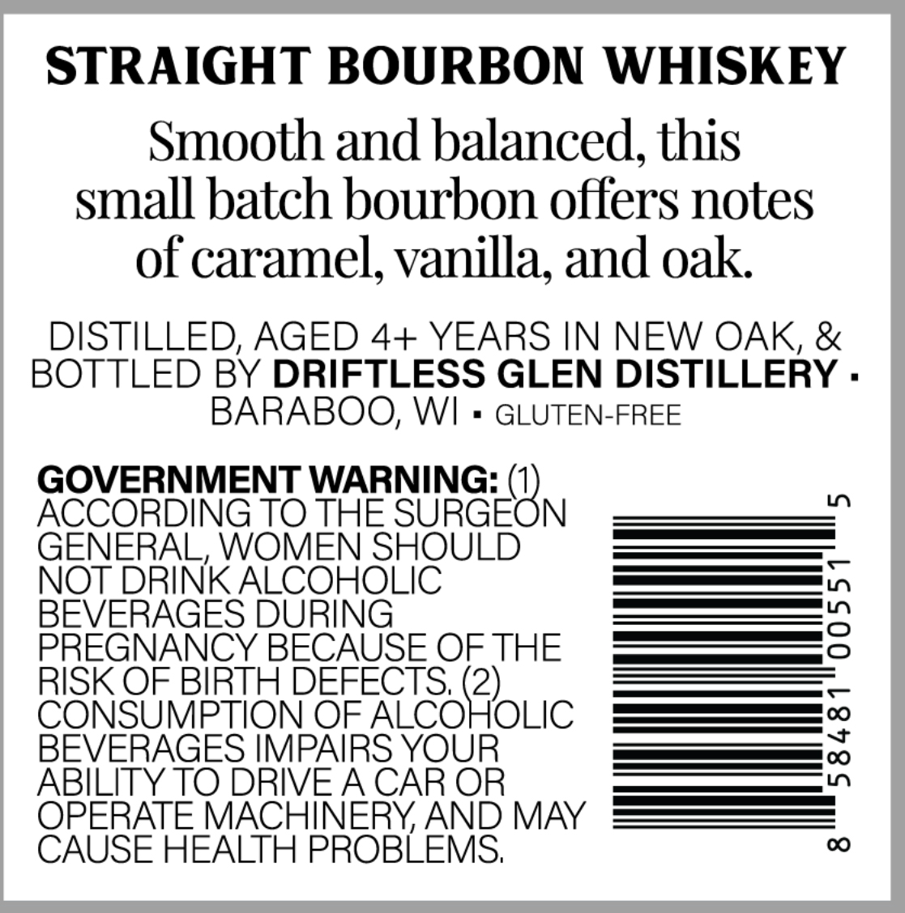
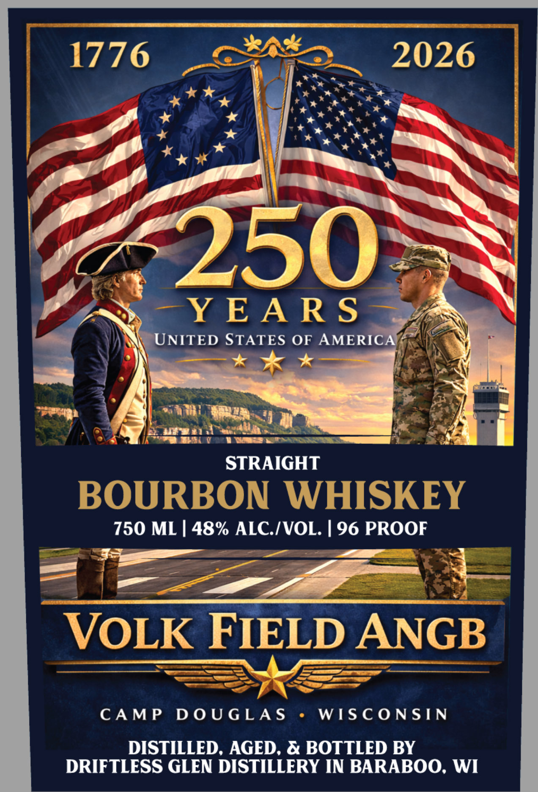

# TTB COLA Label Images - TTBID 26106001000538

**Brand Name:** VOLK FIELD ANGB

**Issue Date:** 04/21/2026

**Origin Code:** 48

**Product Class/Type:** 101

**Source:** [TTB Public COLA Registry](https://ttbonline.gov/colasonline/viewColaDetails.do?action=publicFormDisplay&ttbid=26106001000538)

## Label Images

### Back Label

### Front Label

## Extracted Label Text

*Text extracted via OCR - may contain errors*

**Detected Proof:** 96

### Back Label

STRAIGHT BOURBON WHISKEY
Smooth and balanced; this
small batch bourbon offers notes
of caramel; vanilla; and oak
DISTILLED, AGED 4+ YEARS IN NEW OAK, &
BOTTLED BY DRIFTLESS GLEN DISTILLERY .
BARABOO, WI
GLUTEN-FREE
GOVERNMENT WARNING:
ACCORDING TO THE
SURGEBN
Ln
GENERAL, WOMEN SHOULD
NOT DRINK ALCOHOLIC
BEVERAGES DURING
2
PREGNANCY BECAUSE OF THE
RISK OF BIRTH DEFECTS; (2)_
CONSUMPTION OF ALCOHOLIC
BEVERAGES IMPAIRS YOUR
1
ABILITY TO DRIVEACAR OR
OPERATE MACHINERYAND MAY
CAUSE HEALTH PROBLEMS;
0

### Front Label

1776
2026
250
Y EA RS
UNITED STATES OF AMERICA"
STRAIGHT
BOURBON WHISKEY
750 ML | 48% ALCIVOL. [ 96 PROOF
VOLK FIELD ANGB
CAMP
D 0 U G LA S
WIS C ONSIN
DISTILLED, AGED, & BOTTLED BY
DRIFTLESS GLEN DISTILLERY IN BARABOO, WI
