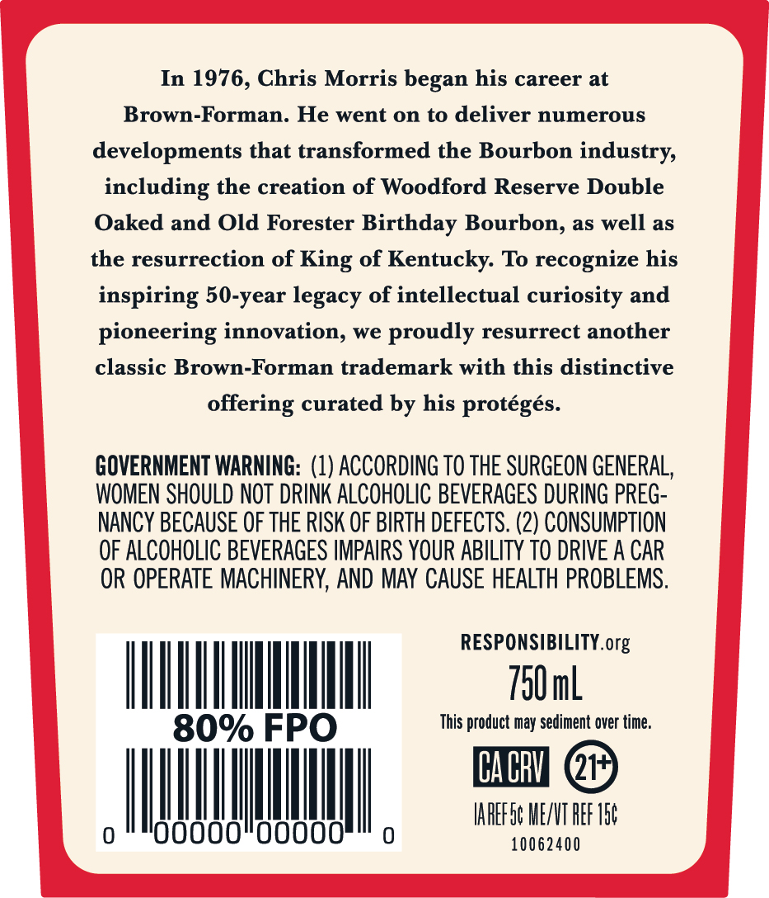
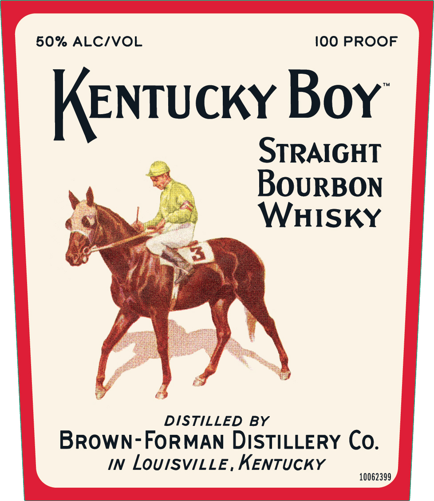
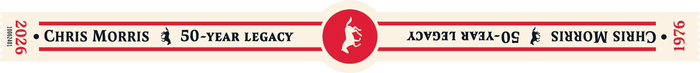

# TTB COLA Label Images - TTBID 26106001000553

**Brand Name:** KENTUCKY BOY

**Issue Date:** 04/20/2026

**Origin Code:** 22

**Product Class/Type:** 101

**Source:** [TTB Public COLA Registry](https://ttbonline.gov/colasonline/viewColaDetails.do?action=publicFormDisplay&ttbid=26106001000553)

## Label Images

### Back Label

### Front Label

### Label 3

## Extracted Label Text

*Text extracted via OCR - may contain errors*

**Detected Proof:** 100

### Back Label

In 1976, Chris Morris began his career at
Brown-Forman. He went 0n to deliver numerous
developments that transformed the Bourbon industry
including the creation of Woodford Reserve Double
Oaked and Old Forester Birthday Bourbon, as well as
the resurrection of King of Kentucky: To recognize his
inspiring 50-year legacy of intellectual curiosity and
pioneering innovation, we proudly resurrect another
classic Brown-Forman trademark with this distinctive
offering curated by his proteges.
GOVERNMENT WARNING: (1) ACCORDING TO THE SURGEON GENERAL,
WOMEN SHOULD NOT  DRINK ALCOHOLIC BEVERAGES DURING PREG-
NANCY BECAUSE OF THE RISK OF BIRTH DEFECTS. (2) CONSUMPTION
OF ALCOHOLIC BEVERAGES IMPAIRS YOUR ABILITY TO DRIVE A CAR
OR OPERATE MACHINERY, AND MAY CAUSE HEALTH PROBLEMS.
RESPONSIBILITYorg
750mL
80% FPO
This product may sediment over time
CA BRV
IAREF S6 MEZNT REF I56
OoooO
OooO
10062400

### Front Label

50% ALCIVOL
I00 PROOF
KenTuckx Box
STRAIGHT
BoURBON
WHISKY
DISTILLED
BY
BROWN-FORMAN DISTILLERY Co.
IN
LouISViLLE, KENTUCKY
10062399 ,

### Label 3

1
8
CHRIS MORRIS
50-YEAR LEGACY
XOVDJT #VAX-OG
SIHHOW SIHHD
g
