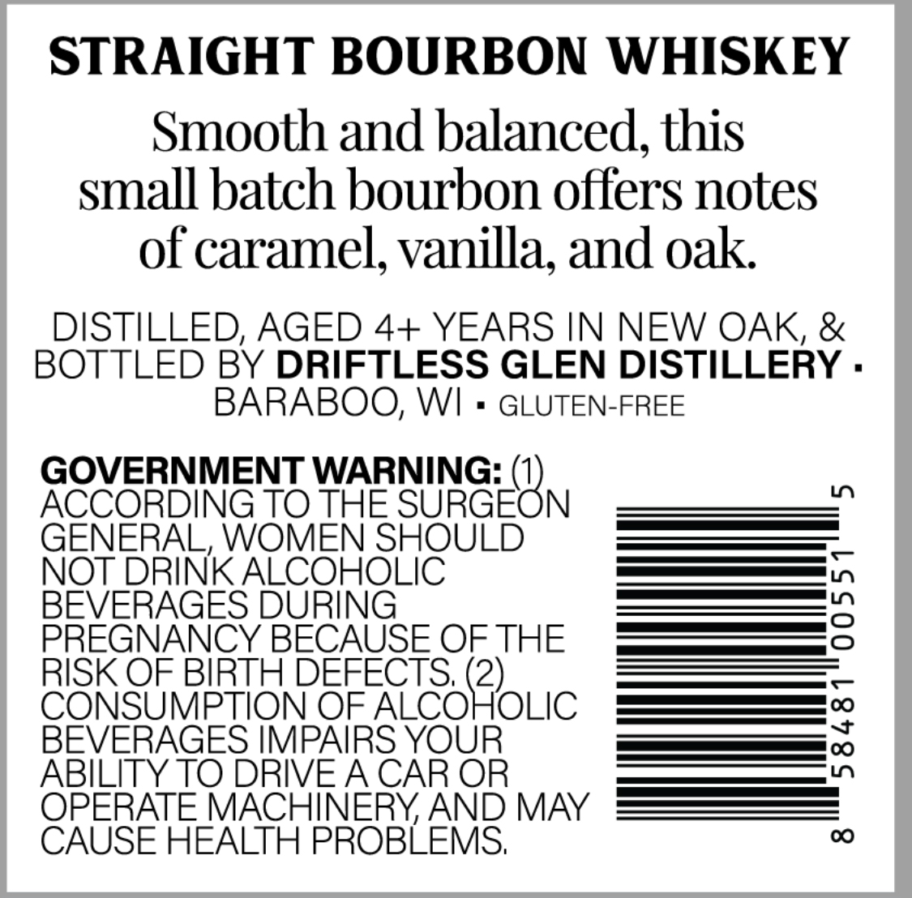
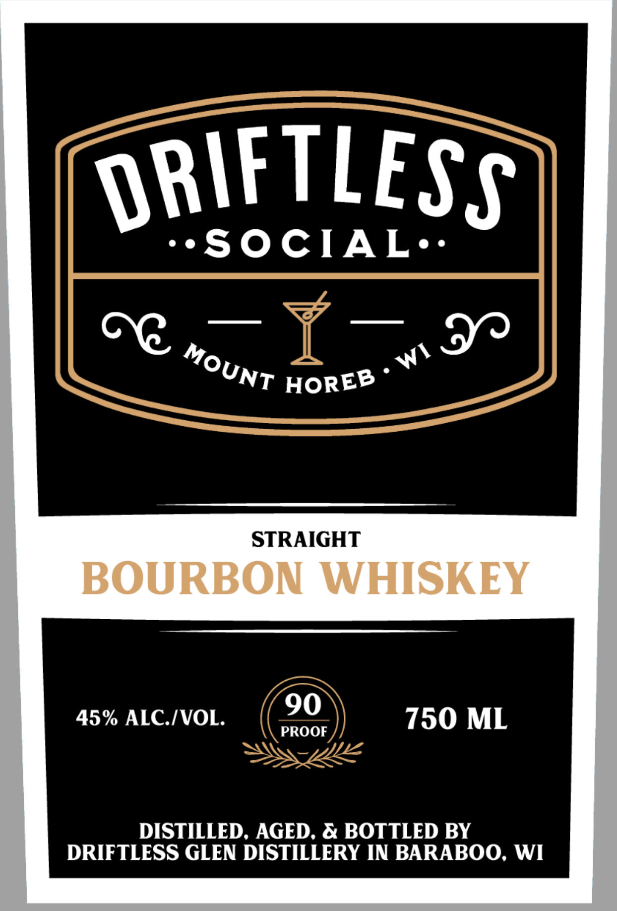

# TTB COLA Label Images - TTBID 26106001000562

**Brand Name:** DRIFTLESS SOCIAL MOUNT HOREB WI

**Issue Date:** 04/17/2026

**Origin Code:** 48

**Product Class/Type:** 101

**Source:** [TTB Public COLA Registry](https://ttbonline.gov/colasonline/viewColaDetails.do?action=publicFormDisplay&ttbid=26106001000562)

## Label Images

### Back Label

### Front Label

## Extracted Label Text

*Text extracted via OCR - may contain errors*

**Detected Proof:** 90

### Back Label

STRAIGHT BOURBON WHISKEY
Smooth and balanced; this
small batch bourbon offers notes
of caramel; vanilla; and oak
DISTILLED, AGED 4+ YEARS IN NEW OAK, &
BOTTLED BY DRIFTLESS GLEN DISTILLERY .
BARABOO; WI
GLUTEN-FREE
GOVERNMENT WARNING:
0
ACCORDING TO THE SURGEON
GENERAL, WOMEN SHOULD
NOT DRINK ALCOHOLIC
BEVERAGES DURING
3
PREGNANCY BECAUSE OF THE
RISK OF BIRTH DEFECTS, (2)
CONSUMPTION OF ALCOHOLIC
BEVERAGES IMPAIRS YOUR
1
ABILITY TO DRIVEA CAR OR
OPERATE MACHINERYAND MAY
CAUSE HEALTH PROBLEMS;
0

### Front Label

ORIFTLESS
'SOCIAL.
9
STRAIGHT
BOURBON WHISKEY
90
45% ALCIVOL
750 ML
PROOF
DISTILLED. AGED. & BOTTLED BY
DRIFTLESS GLEN DISTILLERY IN BARABOO. WI
WI
MOUNT
HOREB
