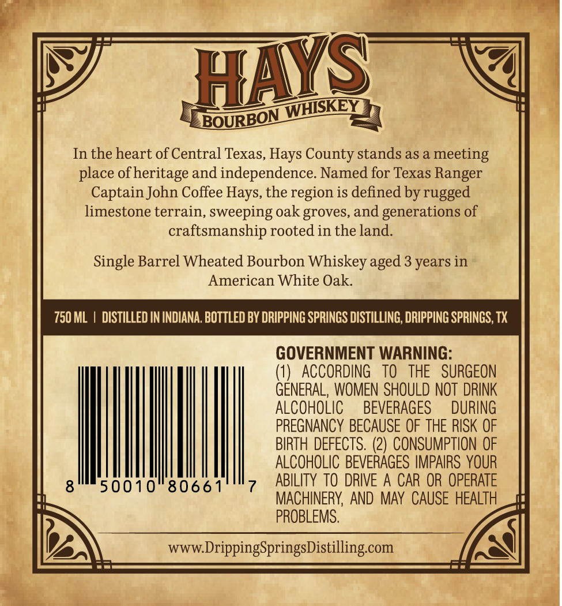
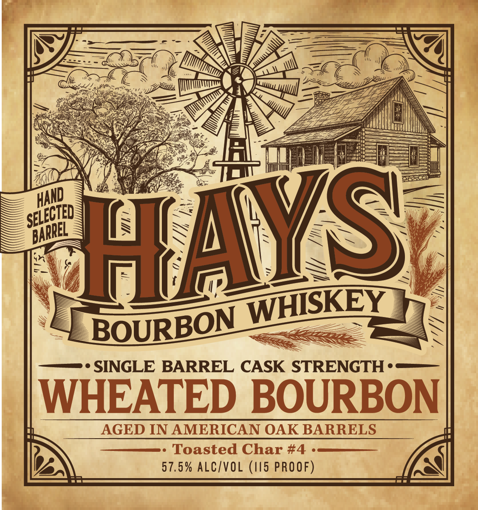

# TTB COLA Label Images - TTBID 26106001000589

**Brand Name:** HAYS BOURBON WHISKEY

**Fanciful Name:** SINGLE BARREL CASK STRENGTH WHEATED BOURBON

**Issue Date:** 04/20/2026

**Origin Code:** 44

**Product Class/Type:** 141

**Source:** [TTB Public COLA Registry](https://ttbonline.gov/colasonline/viewColaDetails.do?action=publicFormDisplay&ttbid=26106001000589)

## Label Images

### Back Label

### Front Label

## Extracted Label Text

*Text extracted via OCR - may contain errors*

**Detected Age:** 3 Years

### Back Label

WSKEY
BOURBON
In the heart of Central Texas, Hays County stands as a
meeting
place ofheritage and independence. Named for Texas Ranger
Captain John Coffee Hays, the region is defined by rugged
limestone terrain, sweeping oak groves, and generations of
craftsmanship rooted in the land.
Single Barrel Wheated Bourbon Whiskey =
3 years in
American White Oak.
750 ML
DISTILLED IN INDIANA. BOTTLED BY DRIPPING SPRINGS DISTILLING, DRIPPING SPRINGS; TX
GOVERNMENT WARNING:
1)
ACCORDING
TO
THE   SURGEON
GENERAL,  WOMEN SHOULD NOT  DRINK
ALCOHOLIC
BEVERAGES
DURING
PREGNANCY BECAUSE OF THE RISK OF
BIRTH DEFECTS. (2) CONSUMPTION OF
ALCOHOLIC BEVERAGES IMPAIRS YOUR
50010
8066 1
ABILITY TO DRIVE A CAR OR OPERATE
MACHINERY, AND MAy CAUSE HEALTH
PROBLEMS,
www DrippingSpringsDistillingcom
HMS
aged

### Front Label

WSKEY
BOURBON
SINGLE BARREL CASK STRENGTH -
WHEATED BOURBON
AGED IN AMERICAN OAK BARRELS
Toasted Char #4
57,5% ALC/VOL (I5 PROOF)
Av
KA
HAND
SELECIED
BARREL
