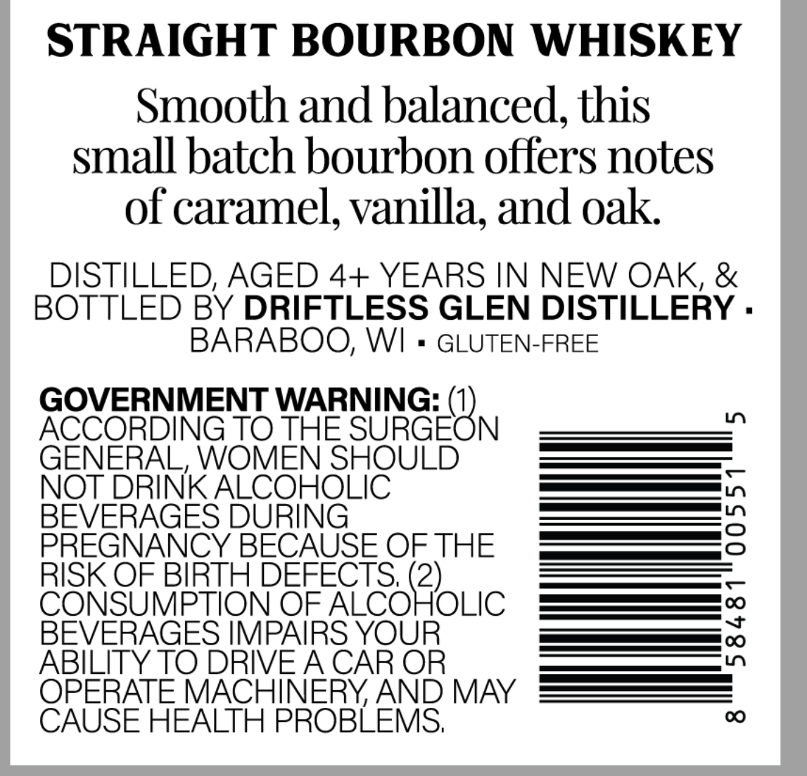
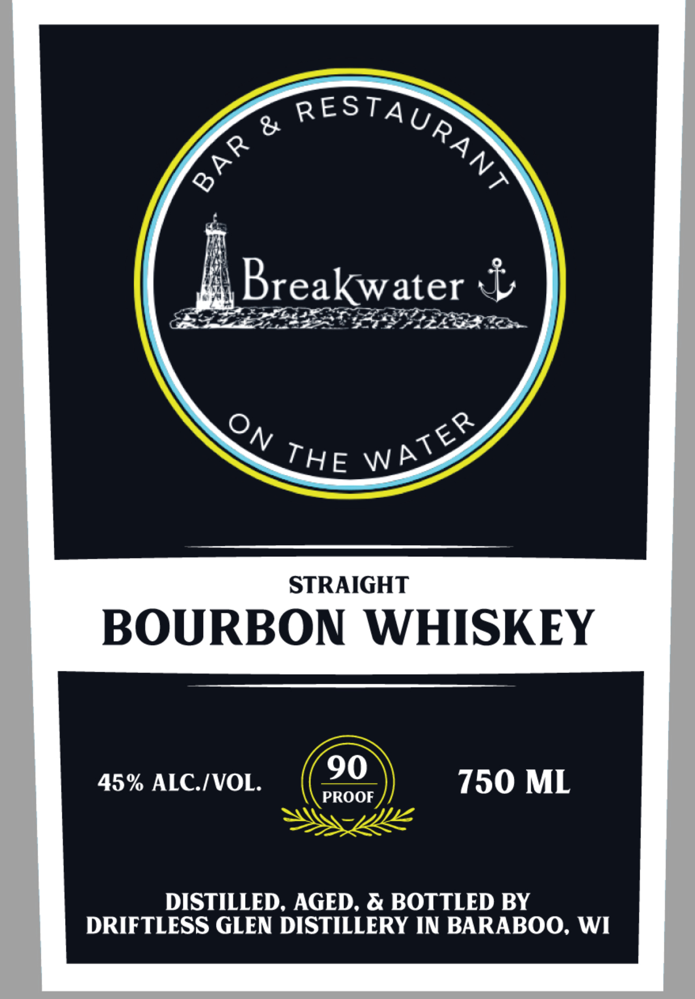

# TTB COLA Label Images - TTBID 26106001000598

**Brand Name:** BREAKWATER

**Issue Date:** 04/17/2026

**Origin Code:** 48

**Product Class/Type:** 101

**Source:** [TTB Public COLA Registry](https://ttbonline.gov/colasonline/viewColaDetails.do?action=publicFormDisplay&ttbid=26106001000598)

## Label Images

### Back Label

### Front Label

## Extracted Label Text

*Text extracted via OCR - may contain errors*

**Detected Proof:** 90

### Back Label

STRAIGHT BOURBON WHISKEY
Smooth and balanced, this
small batch bourbon offers notes
of caramel, vanilla; and oak
DISTILLED, AGED 4+ YEARS IN NEW OAK, &
BOTTLED BY DRIFTLESS GLEN DISTILLERY .
BARABOO; WI
GLUTEN-FREE
GOVERNMENT WARNING:
ACCORDING TO THE
SUKGEON
1n
GENERAL, WOMEN SHOULD
NOT DRINK ALCOHOLIC
BEVERAGES DURING
2
PREGNANCY BECAUSE OF THE
RISK OF BIRTH DEFECTS; (2)
CONSUMPTION OF ALCOHOLIC
BEVERAGES IMPAIRS YOUR
3
ABILITY TO DRIVEACAR OR
OPERATE MACHINERYAND MAY
CAUSE HEALTH PROBLEMS;
0

### Front Label

RESTA Up

VW

:

water db

= =

Breaky

Vs

PPR LLELIBR Ton

re WH

STRAIGHT

BOURBON WHISKEY

45% ALC./VOL

90

PROOF

750 ML

DISTILLED, AGED, & BOTTLED BY

DRIFTLESS GLEN DISTILLERY IN BARABOO, WI
