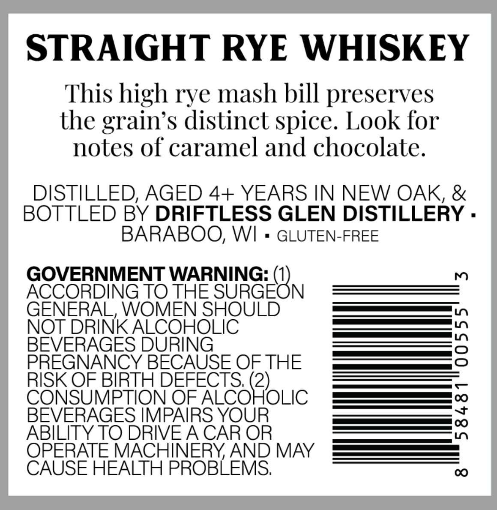
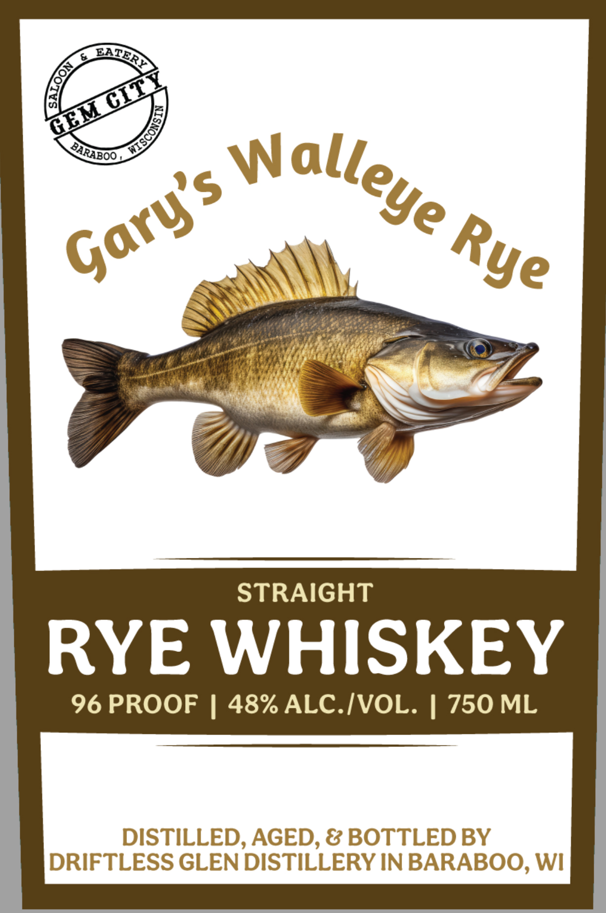

# TTB COLA Label Images - TTBID 26106001000638

**Brand Name:** GARY'S WALLEYE RYE

**Issue Date:** 04/20/2026

**Origin Code:** 48

**Product Class/Type:** 102

**Source:** [TTB Public COLA Registry](https://ttbonline.gov/colasonline/viewColaDetails.do?action=publicFormDisplay&ttbid=26106001000638)

## Label Images

### Back Label

### Front Label

## Extracted Label Text

*Text extracted via OCR - may contain errors*

**Detected Proof:** 96

### Back Label

STRAIGHT RYE WHISKEY
This high rye mash bill preserves
the grain's distinct spice. Look for
notes of caramel and chocolate.
DISTILLED, AGED 4+ YEARS IN NEW OAK &
BOTTLED BY DRIFTLESS GLEN DISTILLERY .
BARABOO, WI
GLUTEN-FREE
GOVERNMENT WARNING:
m
ACCORDING TO THE
'SURGEON
GENERAL, WOMEN SHOULD
NOT DRINK ALCOHOLIC
BEVERAGES DURING
3
PREGNANCY BECAUSE OF THE
RISK OF BIRTH DEFECTS; (2)
CONSUMPTION OF ALCOHOLIC
BEVERAGES IMPAIRS YOUR
0
ABILITY TO DRIVEA CAR OR
OPERATE MACHINERYAND MAY
CAUSE HEALTH PROBLEMS;
0O

### Front Label

STRAIGHT
RYE WHISKEY
96 PROOF
1 48% ALC.IVOL: | 750 ML
DISTILLED, AGED, & BOTTLED BY
DRIFTLESS GLEN DISTILLERY IN BARABOO, WI
ATER}
HMUIT
)
Walleye
BARABOO
Gary's
Rye
