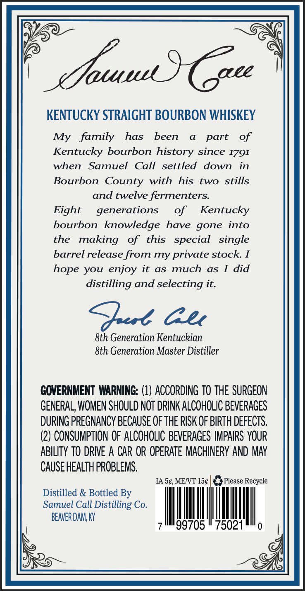
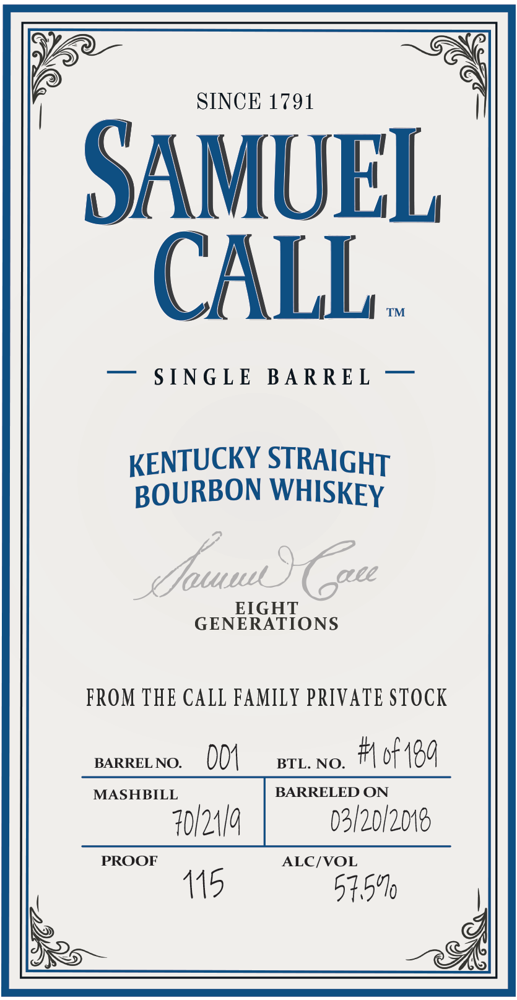
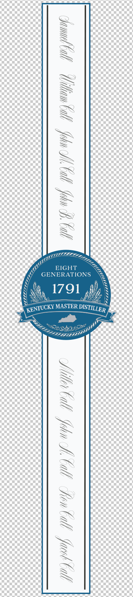

# TTB COLA Label Images - TTBID 26106001000641

**Brand Name:** SAMUEL CALL

**Fanciful Name:** KENTUCKY STRAIGHT BOURBON WHISKEY

**Issue Date:** 04/20/2026

**Origin Code:** 22

**Product Class/Type:** 101

**Source:** [TTB Public COLA Registry](https://ttbonline.gov/colasonline/viewColaDetails.do?action=publicFormDisplay&ttbid=26106001000641)

## Label Images

### Back Label

### Front Label

### Label 3

## Extracted Label Text

*Text extracted via OCR - may contain errors*

### Back Label

Sjauuu
(aee
KENTUCKY STRAIGHT BOURBON WHISKEY
My
family
has
been
part
of
Kentucky bourbon history since 1791
when
Samuel
Call  settled
down
in
Bourbon County
with
his
two
stills
and twelve fermenters:
Eight
generations
of
Kentucky
bourbon
knowledge have gone
into
the
making
of
this
special
single
barrel release from my private stock
hope you enjoy it
as
much
as
did
distilling and selecting it:
9t Ge
8th Generation Kentuckian
8th Generation Master Distiller
GOVERNMENT WARNING: (1) ACCORDING TO THE SURGEON
GENERAL; WOMEN SHOULD NOT DRINK ALCOHOLIC BEVERAGES
DURING PREGNANCY BECAUSE OF THE RISK OF BIRTH DEFECTS.
(2) CONSUMPTION OF ALCOHOLIC BEVERAGES IMPAIRS YOUR
ABILITY TO DRIVE A CAR OR OPERATE MACHINERY AND MAY
CAUSE HEALTH PROBLEMS.
IA 5c,MENT 15c
Please Recycle
Distilled & Bottled By
Samuel Call Distilling Co.
BEAVER DAM; Ky
99705
75021

### Front Label

SINCE 1791
SAMUEL
CALL
TM
S TNG L E
BAR RE L
KENTUCKY STRAIGHT
BOURBON WHISKEY
dJat
1u
aee
EIGHT
GENERATIONS
FROM THE CALL FAMILY PRIVATE STOCK
BARREL NO.
OM
BTL. NO_
6f 130
MASHBILL
BARRELED ON
40/21q
03/20/2018
PROOF
ALC/VOL
115
515'1

### Label 3

Z
fe}
a
ze
a
i
Zz
ra

tome Willan tall fin A. tal fin A tal Ser Coll un A Ci Final Sal Cul

G
