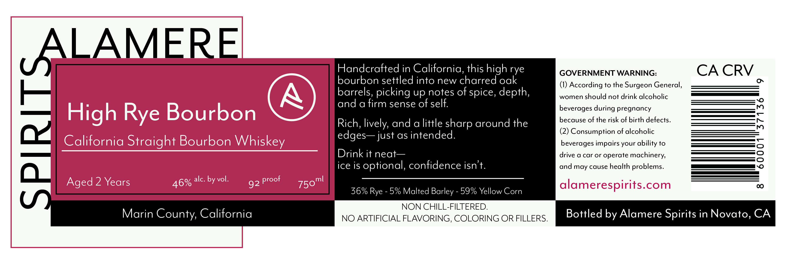

# TTB COLA Label Images - TTBID 26106001000739

**Brand Name:** ALAMERE SPIRITS

**Fanciful Name:** HIGH RYE BOURBON

**Issue Date:** 04/29/2026

**Origin Code:** 01

**Product Class/Type:** 101

**Source:** [TTB Public COLA Registry](https://ttbonline.gov/colasonline/viewColaDetails.do?action=publicFormDisplay&ttbid=26106001000739)

## Label Images

### Label 1

### Label 2

## Extracted Label Text

*Text extracted via OCR - may contain errors*

*1 image(s) excluded: text did not meet readability threshold*

**Detected Proof:** 92
**Detected Age:** 2 Years

### Label 1

ALAMERE
Handcrafted in California, this high rye
GOVERNMENT WARNING:
CA CRV
bourbon settled into new charred oak
(1) According to the Surgeon General,
barrels, picking up notes of spice, depth,
women should not drink alcoholic
and a firm sense of
O
High Rye Bourbon
Rich, lively, and a little sharp around the
becerasgeoi dbeingkoe Giahdefects.
i
(2) Consumption of alcoholic
California Straight Bourbon Whiskey_
just as intended_
beverages impairs your ability to
Drink it neat
drive a car or operate
machinery,
{7
0
ice is optional; confidence isn't.
and may cause
lth problems.
Aged 2 Years
alc. by vol.
92
75oml
alamerespirits.com
0
36% Rye
5% Malted Barley
59% Yellow Corn
NON CHILL-FILTERED:
Marin County; California
NO ARTIFICIAL FLAVORING, COLORING OR FILLERS
Bottled by Alamere Spirits in Novato, CA
self:
edges
hea
proof
46%
